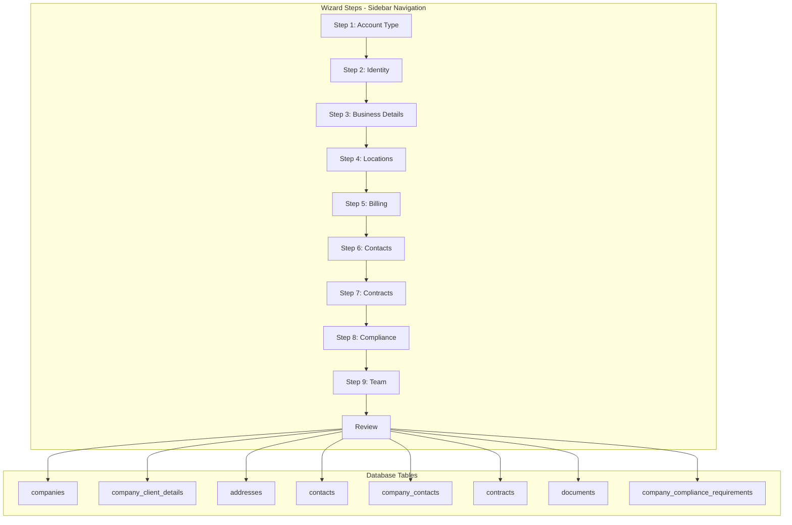
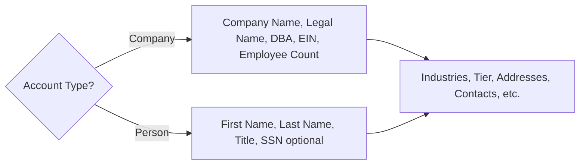

# Account Creation Wizard - Comprehensive Enhancement

---

## Requirements

### Business Requirements

1. **Account Types**: The wizard must support two account types:
   - **Company**: A business entity (corporation, LLC, etc.) that provides job requisitions
   - **Person**: An individual (consultant, sole proprietor) who provides job requisitions at individual capacity
   - Person accounts behave the same as Company accounts - the main difference is Company Name becomes Person's Full Name

2. **Comprehensive Data Capture**: The wizard must capture the full spectrum of account data in a single creation flow:
   - Core account identity and classification
   - Multiple addresses (HQ, Billing, Mailing, etc.)
   - Multiple contacts with roles (Primary, Billing, Executive Sponsor, etc.)
   - Contracts and agreements (MSA, NDA, SOW, etc.)
   - Compliance requirements (Insurance, Background checks, Certifications)
   - Internal team assignment (Owner, Account Manager, Recruiters)
   - Documents with file upload capability

3. **Wizard Structure**: Each step should focus on one logical object/concept related to the Account

4. **Guidewire Standards**: Follow Guidewire PolicyCenter UI patterns for recruiting firm workflows

### UI/UX Requirements

1. **Sidebar Step Navigation** (Guidewire pattern):
   - **Integration**: Use the existing global sidebar container (`ResizableSidebarWrapper`) to display wizard steps instead of creating a nested sidebar.
   - **Implementation**: The wizard page should be wrapped in `SidebarLayout` with a custom sidebar component passed in.
   - Left sidebar showing all wizard steps with labels
   - Step completion indicators (dots for pending, checkmarks for complete, highlight for current)
   - Submission/Account header at top of sidebar showing draft status
   - "Tools" section at bottom of sidebar for Notes, Documents, Participants
   - Remove horizontal step indicator from top of wizard

2. **Main Content Area**:
   - Step title at top
   - Navigation buttons (Back, Next, Save Draft, Cancel) at top right of content area
   - Form content below with Section components
   - Collapsible cards for repeating items (addresses, contacts, contracts)

3. **Layout Structure**:
   ```
   ┌─────────────────────────────────────────────────────────────────┐
   │ Header: "Create New Account" + Auto-save indicator              │
   ├──────────────┬──────────────────────────────────────────────────┤
   │ SIDEBAR      │ MAIN CONTENT                                     │
   │              │                                                  │
   │ New Account  │ Step Title                    [Back] [Next] ... │
   │ Draft        │                                                  │
   │              │ ┌────────────────────────────────────────────┐  │
   │ ● Account    │ │ Section 1                                  │  │
   │   Type       │ │ [Form fields...]                           │  │
   │ ○ Identity   │ └────────────────────────────────────────────┘  │
   │ ○ Business   │                                                  │
   │ ○ Locations  │ ┌────────────────────────────────────────────┐  │
   │ ○ Billing    │ │ Section 2                                  │  │
   │ ○ Contacts   │ │ [Form fields...]                           │  │
   │ ○ Contracts  │ └────────────────────────────────────────────┘  │
   │ ○ Compliance │                                                  │
   │ ○ Team       │                                                  │
   │ ○ Review     │                                                  │
   │              │                                                  │
   │ ─────────── │                                                  │
   │ Tools ▼     │                                                  │
   │  📝 Notes   │                                                  │
   │  📄 Docs    │                                                  │
   └──────────────┴──────────────────────────────────────────────────┘
   ```

4. **Premium Styling**: Use existing Hublot-inspired design system with gold accents

### Technical Requirements

1. **Store**: Zustand store with persistence (hybrid approach):
   - **Local**: `persist` middleware for immediate, offline-tolerant state and fast navigation.
   - **Server**: Integration with `drafts` router for cross-device persistence.
2. **Validation**: Per-step validation with Zod schemas.
3. **Backend**: Transactional multi-table insert (companies + client_details + addresses + contacts + contracts + compliance).
4. **File Upload**: "Immediate Upload" pattern. Upload files to Supabase Storage upon selection; store paths in Zustand state. The final `accounts.create` mutation receives references/paths.

---

## Current State

- **Location**: `http://localhost:3000/employee/recruiting/accounts/new`
- **Current Steps**: 3 steps (Company Basics, Billing & Terms, Primary Contact)
- **Current Layout**: Horizontal step indicator at top (to be replaced with sidebar)
- **Store**: `src/stores/create-account-store.ts`
- **Config**: `src/configs/entities/wizards/account-create.config.tsx`
- **Components**: `src/components/recruiting/accounts/intake/`
- **Wizard Component**: `src/components/pcf/wizard/EntityWizard.tsx`

---

## Target State

A comprehensive 10-step wizard with:
- Sidebar step navigation (Guidewire pattern)
- Company/Person account type support
- All related objects captured in creation flow
- **Robust Draft Persistence**: Ability to leave and resume later from any device (server-side drafts).

---

## Architecture

### Wizard Flow



### Account Type Logic



---

## Wizard Steps Design

### Step 1: Account Type Selection
- **Focus**: Choose between Company or Person account type
- **Fields**:
  - Account Type (Company / Person) - Large card selector with icons
  - For Person: First Name, Last Name, Email (required)
  - For Company: Company Name (required)
- **Conditional Logic**: Sets context for subsequent steps

### Step 2: Identity & Profile
- **Focus**: Core identity fields from `companies` table
- **Company Fields**: Name, Legal Name, DBA, Tax ID (EIN), Website, Phone, LinkedIn URL, Description
- **Person Fields**: Full Name, Professional Title, Personal Website, Phone, LinkedIn URL, Bio
- **Common Fields**: Primary Email, Status (Prospect/Active)

### Step 3: Business Classification
- **Focus**: Business categorization and relationship
- **Fields**:
  - Industries (multi-select pills)
  - Company Type (Direct Client / Implementation Partner / Staffing Vendor)
  - Partnership Tier (Preferred / Strategic / Exclusive)
  - Segment (Enterprise / Mid-Market / SMB / Startup)
  - Employee Count / Revenue Range
  - Founded Year
  - Ownership Type

### Step 4: Locations & Addresses
- **Focus**: Multiple addresses from `addresses` table
- **Address Types**: Headquarters, Billing, Mailing, Office, Shipping
- **Fields per Address**:
  - Address Type (dropdown)
  - Address Line 1, 2, 3
  - City, State/Province, Postal Code, Country
  - Is Primary checkbox
- **UI Pattern**: Collapsible address cards with "Add Address" button

### Step 5: Billing & Payment Terms
- **Focus**: `company_client_details` billing fields
- **Fields**:
  - Billing Entity Name
  - Billing Email, Phone
  - Billing Frequency (Weekly / Bi-weekly / Monthly)
  - Payment Terms (Net 15 / 30 / 45 / 60)
  - PO Required toggle
  - Current PO Number, PO Expiration
  - Invoice Format, Consolidation preference
  - Default Currency, Markup/Fee Percentage

### Step 6: Contacts
- **Focus**: Multiple contacts from `contacts` + `company_contacts`
- **Contact Roles**: Primary, Billing, Executive Sponsor, Hiring Manager, HR, Procurement
- **Fields per Contact**:
  - First Name, Last Name, Email, Phone, Mobile
  - Job Title, Department
  - Decision Authority (Decision Maker / Influencer / Champion / Gatekeeper)
  - Preferred Contact Method
  - Is Primary toggle
- **UI Pattern**: Contact cards with role badges, "Add Contact" button

### Step 7: Contracts & Agreements
- **Focus**: `contracts` table entries
- **Contract Types**: MSA, NDA, SOW, Rate Agreement, Subcontract
- **Fields per Contract**:
  - Contract Type, Name, Number
  - Status (Draft / Active / Pending Signature)
  - Effective Date, Expiration Date
  - Auto-Renews toggle, Renewal Terms
  - Contract Value, Currency
  - Document Upload (Immediate upload to Supabase)
- **UI Pattern**: Contract cards with status badges

### Step 8: Compliance Requirements
- **Focus**: `company_compliance_requirements` fields
- **Sections**:
  - **Insurance**: General Liability, Professional Liability, Workers Comp, Cyber Liability (required toggles + minimum amounts)
  - **Background Checks**: Required toggle, Level, Vendor, Max Age
  - **Drug Testing**: Required toggle, Type, Frequency
  - **Certifications**: Security Clearance, HIPAA, SOX, PCI, FedRAMP
  - **Work Authorization**: Citizenship requirements, Visa types accepted
  - **Documents Required**: W9, NDA, Non-compete, I-9 verification method

### Step 9: Internal Team Assignment
- **Focus**: Team members from `user_profiles`
- **Roles**:
  - Account Owner (required)
  - Account Manager
  - Primary Recruiter
  - Sales Lead
  - Executive Sponsor
- **UI Pattern**: User search/select with avatar display

### Step 10: Review & Create
- **Focus**: Summary of all entered data
- **Sections**: Collapsible sections for each step with edit buttons
- **Validation**: Final validation before submission

---

## Key Files to Modify/Create

### Wizard Logic Hook (NEW)
- `src/hooks/use-entity-wizard.ts` - Extract core wizard logic:
  - State management (Zustand + Persistence)
  - Server-side draft sync (debounce updates to `drafts` router)
  - Navigation and Validation logic

### Wizard Layout Component (NEW)
- `src/components/pcf/wizard/WizardWithSidebar.tsx` - Wrapper component that uses the global `SidebarLayout`. It passes a new `WizardStepsSidebar` to the sidebar slot and renders the form in the main content area.
- Update `src/components/layouts/SidebarLayout.tsx` to accept a `customSidebar` prop to override default entity/section navigation.

### Store Enhancement
- `src/stores/create-account-store.ts` - Extend with all new fields and nested objects:
  - `accountType: 'company' | 'person'`
  - `addresses: Address[]`
  - `contacts: Contact[]`
  - `contracts: Contract[]`
  - `compliance: ComplianceRequirements`
  - `team: TeamAssignment`

### Wizard Config
- `src/configs/entities/wizards/account-create.config.tsx` - Add all 10 step configurations

### New Step Components (in `src/components/recruiting/accounts/intake/`)

| File | Purpose |
|------|---------|
| `AccountIntakeStep0Type.tsx` | Account type selector (Company/Person) |
| `AccountIntakeStep1Identity.tsx` | Rename/enhance current basics step |
| `AccountIntakeStep2Classification.tsx` | Business classification (industries, tier, segment) |
| `AccountIntakeStep3Locations.tsx` | Multi-address management with add/remove |
| `AccountIntakeStep4Billing.tsx` | Enhanced billing and payment terms |
| `AccountIntakeStep5Contacts.tsx` | Multi-contact management with roles |
| `AccountIntakeStep6Contracts.tsx` | Contract management with document upload |
| `AccountIntakeStep7Compliance.tsx` | Insurance, background, certifications |
| `AccountIntakeStep8Team.tsx` | Internal team assignment with user search |

### Backend Enhancement
- `src/server/routers/crm.ts` - Enhance `accounts.create` mutation to handle all related objects in a transaction

---

## Sidebar Navigation Component Design

### WizardStepsSidebar Component
(To be passed into SidebarLayout's custom sidebar slot)

```tsx
// Guidewire-inspired sidebar navigation
interface WizardStepsSidebarProps {
  title: string                    // "New Account"
  status: string                   // "Draft"
  steps: WizardStepConfig[]
  currentStep: number
  completedSteps: number[]
  onStepClick: (step: number) => void
  tools?: {
    showNotes?: boolean
    showDocuments?: boolean
    showParticipants?: boolean
  }
}
```

### Visual States for Steps
- **Pending**: Hollow circle (○) + muted text
- **Current**: Filled circle with highlight (●) + bold text + background highlight
- **Completed**: Checkmark (✓) + normal text
- **Has Errors**: Red indicator

### Sidebar Sections
1. **Header**: Account name/title + Draft status badge
2. **Steps List**: Scrollable list of all wizard steps
3. **Divider**
4. **Tools Section** (collapsible): Notes, Documents, Participants quick access

---

## Database Schema Reference

### companies table (main account record)
Key fields: `id`, `org_id`, `category`, `relationship_type`, `segment`, `tier`, `status`, `name`, `legal_name`, `dba_name`, `industry`, `industries[]`, `sic_code`, `naics_code`, `employee_count`, `annual_revenue`, `founded_year`, `ownership_type`, `parent_company_id`, `website`, `phone`, `linkedin_url`, `headquarters_city`, `headquarters_state`, `headquarters_country`, `owner_id`, `account_manager_id`, `primary_contact_id`, `msa_status`, `default_payment_terms`, `default_currency`, `description`, `tags[]`, `custom_fields`

### company_client_details table (billing info)
Key fields: `company_id`, `billing_entity_name`, `billing_email`, `billing_phone`, `billing_frequency`, `po_required`, `current_po_number`, `po_expiration_date`, `invoice_format`, `invoice_consolidation`, `billing_address_*`, `preferred_work_arrangements[]`, `preferred_contract_types[]`, `allows_contract_to_hire`, `cth_conversion_fee_percentage`, `responsiveness_rating`, `feedback_quality_rating`, `hiring_speed_rating`, `typical_interview_rounds`, `avg_time_to_decision_days`, `exclusive_supplier`, `wallet_share_percentage`, `qbr_frequency`

### addresses table (polymorphic)
Key fields: `id`, `org_id`, `entity_type` ('account'), `entity_id`, `address_type` (headquarters/billing/mailing/office/shipping), `address_line_1/2/3`, `city`, `state_province`, `postal_code`, `country_code`, `county`, `latitude`, `longitude`, `is_verified`, `is_primary`

### contacts table
Key fields: `id`, `org_id`, `first_name`, `last_name`, `email`, `phone`, `mobile`, `linkedin_url`, `title`, `company_id`, `department`, `timezone`, `preferred_contact_method`, `decision_authority`, `buying_role`, `influence_level`, `is_primary`, `tags[]`

### company_contacts table (junction)
Key fields: `id`, `org_id`, `company_id`, `contact_id`, `job_title`, `department`, `role_description`, `decision_authority`, `influence_level`, `is_primary`, `relationship_strength`, `preferred_contact_method`

### contracts table (polymorphic)
Key fields: `id`, `org_id`, `entity_type` ('account'), `entity_id`, `contract_number`, `contract_name`, `contract_type` (msa/nda/sow/amendment/rate_agreement/subcontract), `status`, `effective_date`, `expiry_date`, `auto_renew`, `renewal_term_months`, `contract_value`, `currency`, `document_url`

### company_compliance_requirements table
Key fields: `company_id`, `general_liability_required`, `general_liability_minimum`, `professional_liability_required`, `workers_comp_required`, `cyber_liability_required`, `background_check_required`, `background_check_level`, `background_check_vendor`, `drug_test_required`, `drug_test_type`, `drug_test_frequency`, `security_clearance_required`, `security_clearance_level`, `citizenship_required`, `hipaa_training_required`, `sox_compliance_required`, `pci_compliance_required`, `fedramp_required`, `w9_required`, `nda_required`, `non_compete_required`, `i9_verification_method`, `work_authorization_types[]`

### documents table (polymorphic)
Key fields: `id`, `org_id`, `entity_type`, `entity_id`, `file_name`, `file_type`, `mime_type`, `file_size_bytes`, `storage_path`, `public_url`, `document_type`, `document_category`, `description`, `expires_at`, `is_confidential`, `tags[]`

---

## Implementation Todos

| ID | Task | Status |
|----|------|--------|
| refactor-wizard-hook | Extract wizard logic to `useEntityWizard` hook with server draft sync integration | pending |
| create-sidebar-layout | Create `WizardWithSidebar` component - Guidewire-style sidebar step navigation using the hook | pending |
| extend-store | Extend `create-account-store` with all fields and interfaces | pending |
| ui-steps-part1 | Implement UI Components for Steps 0-4 (Identity, Class, Loc, Billing) | pending |
| ui-steps-part2 | Implement UI Components for Steps 5-8 (Contacts, Contracts, Compliance, Team) | pending |
| update-config | Update `account-create.config.tsx` with all 10 steps and validation | pending |
| backend-mutation | Enhance `crm.ts` accounts.create mutation for transactional multi-table insert | pending |
| connect-page | Update new account `page.tsx` to use `WizardWithSidebar` layout | pending |

---

## Implementation Approach

1. **Phase 1: Foundation**: 
   - Extract `useEntityWizard` hook to manage state, navigation, and **server-side draft synchronization**.
   - Update `SidebarLayout` to support custom sidebar injection.
   - Create `WizardWithSidebar` layout component that leverages `SidebarLayout`.
   - Extend store with comprehensive data model.

2. **Phase 2: UI Components**: 
   - Create new step components with Guidewire-inspired UI.
   - Implement **Immediate Upload** for file inputs (contracts, documents) to handle large files efficiently.

3. **Phase 3: Configuration**: 
   - Update wizard config with all 10 steps and Zod validation schemas.

4. **Phase 4: Backend**: 
   - Enhance `crm.accounts.create` to handle transactional creation of Company, Details, Addresses, Contacts, Contracts, and Compliance records.
   - Ensure the mutation accepts file paths/references from the pre-uploaded documents.
   - Clean up server draft upon successful creation.

5. **Phase 5: Integration**: 
   - Update page to use new wizard layout and test full flow including draft resumption.

---

## UI/UX Guidelines (Guidewire-inspired)

### Sidebar Navigation
- Fixed-width sidebar (~280px) on left side
- Dark header section with account title and draft badge
- Step list with visual completion indicators
- Collapsible "Tools" section at bottom
- Smooth transitions when switching steps

### Main Content Area
- Use **Section** components with icons for visual hierarchy
- Use **Card selectors** for mutually exclusive options (Company/Person, Tier, Segment)
- Use **Pill selectors** for multi-select (Industries)
- Use **Collapsible cards** for repeating items (Addresses, Contacts, Contracts)
- Use **Toggle switches** for boolean fields (PO Required, Auto-Renew)
- Include **validation summaries** at bottom of each step
- Support **"Add Item" buttons** for arrays (addresses, contacts, contracts)
- Use **premium styling** with gold accents matching existing design system

### Navigation Buttons
- Position at top-right of content area (not bottom)
- Buttons: Back, Next, Save Draft, Cancel
- Final step: Back, Create Account, Save Draft, Cancel
