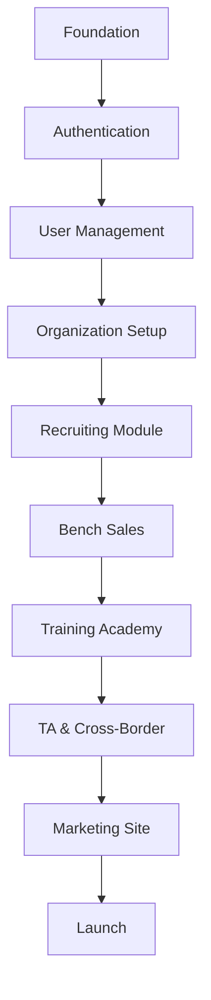

# Sequential Implementation Roadmap
## InTime v3 - From Foundation to Feature-Complete Platform

**Version:** 1.0
**Last Updated:** 2025-11-17
**Estimated Timeline:** 16 weeks to production-ready MVP
**Owner:** Architecture Team

---

## Table of Contents

1. [Overview & Philosophy](#overview--philosophy)
2. [Phase 0: Pre-Flight (Week 0)](#phase-0-pre-flight-week-0)
3. [Phase 1: Foundation (Weeks 1-2)](#phase-1-foundation-weeks-1-2)
4. [Phase 2: Authentication & Core Infrastructure (Weeks 3-4)](#phase-2-authentication--core-infrastructure-weeks-3-4)
5. [Phase 3: First Business Pillar - Recruiting (Weeks 5-7)](#phase-3-first-business-pillar---recruiting-weeks-5-7)
6. [Phase 4: Second Pillar - Bench Sales (Weeks 8-9)](#phase-4-second-pillar---bench-sales-weeks-8-9)
7. [Phase 5: Third Pillar - Training Academy (Weeks 10-12)](#phase-5-third-pillar---training-academy-weeks-10-12)
8. [Phase 6: Remaining Pillars - TA & Cross-Border (Weeks 13-14)](#phase-6-remaining-pillars---ta--cross-border-weeks-13-14)
9. [Phase 7: Polish & Launch (Weeks 15-16)](#phase-7-polish--launch-weeks-15-16)
10. [Dependencies & Critical Path](#dependencies--critical-path)
11. [Risk Mitigation](#risk-mitigation)
12. [Success Metrics](#success-metrics)

---

## Overview & Philosophy

### Why This Order?

The implementation order follows these principles:

1. **Foundation First** - Infrastructure before features
2. **Auth Early** - Security cannot be bolted on later
3. **Revenue-First** - Build highest-revenue pillars first (Recruiting)
4. **Cross-Pollination** - Each pillar feeds data to the next
5. **Test Often** - Automated testing from day one
6. **Small Iterations** - Deploy weekly, learn fast

### Dependency Chain



### Feature Velocity Goals

| Phase | Week | Features/Week | Cumulative Features |
|-------|------|---------------|---------------------|
| **Foundation** | 1-2 | 5 | 10 |
| **Auth** | 3-4 | 8 | 26 |
| **Recruiting** | 5-7 | 10 | 56 |
| **Bench** | 8-9 | 8 | 72 |
| **Academy** | 10-12 | 12 | 108 |
| **TA/Cross** | 13-14 | 8 | 124 |
| **Polish** | 15-16 | 6 | 136 |

**Total:** ~136 features in 16 weeks (using AI agent workflows)

---

## Phase 0: Pre-Flight (Week 0)

**Duration:** 3-5 days (before official start)
**Goal:** Ensure all infrastructure, tools, and documentation are ready

### Day 1-2: Environment & Tools Setup

#### 1.1 Local Development Environment
```bash
# Install required tools
brew install node@20 pnpm

# Verify versions
node -v  # Should be 20.x
pnpm -v  # Should be 9.x+

# Clone repository
git clone https://github.com/your-org/intime-v3.git
cd intime-v3

# Install dependencies
pnpm install

# Verify build
pnpm build
```

**Why:** Catch environment issues before day 1 of implementation.

#### 1.2 Supabase Project Setup
1. Create project at supabase.com
2. Note project URL and keys
3. Enable Auth providers (Email, Google OAuth)
4. Configure SMTP (Resend for transactional email)
5. Create database via SQL editor

**Why:** Database access is critical path for every feature.

#### 1.3 Vercel Project Setup
1. Create Vercel project
2. Connect to GitHub repo
3. Configure environment variables
4. Set up preview deployments
5. Test deployment

**Why:** Deploy early, deploy often requires working CI/CD.

#### 1.4 Configure Services

| Service | Purpose | Setup Time |
|---------|---------|------------|
| **Anthropic API** | AI agents | 5 min |
| **GitHub** | Version control, MCP | 10 min |
| **Supabase** | Database, auth, storage | 30 min |
| **Vercel** | Hosting, deployment | 15 min |
| **Resend** | Transactional email | 10 min |
| **Sentry** | Error tracking | 15 min |
| **Plausible/GA4** | Analytics | 10 min |

### Day 3: Documentation & Standards Review

#### 2.1 Review ADRs
- [ ] Read ADR-001: Use Drizzle ORM
- [ ] Read ADR-002: Standard Schema Patterns
- [ ] Read ADR-003: Multi-Agent Workflow
- [ ] Understand rationale for each decision

**Why:** Everyone must understand WHY we do things this way.

#### 2.2 Database Schema Templates
- [ ] Review TABLE_TEMPLATE.ts
- [ ] Review QUERY_TEMPLATE.ts
- [ ] Review MUTATION_TEMPLATE.ts
- [ ] Create first test table using template

**Why:** Consistency from day one prevents tech debt.

#### 2.3 Agent Workflow Training
- [ ] Run first test workflow: `pnpm orchestrate:feature "Create About page"`
- [ ] Review generated artifacts
- [ ] Approve/reject practice
- [ ] Understand approval gates

**Why:** Team must be comfortable with AI-driven development.

### Day 4-5: Marketing Site Migration Prep

#### 3.1 Content Audit
- [ ] Review existing intimeesolutions.com
- [ ] Extract all content to markdown
- [ ] Identify which pages to migrate
- [ ] Plan content improvements

**Why:** Marketing site can be built in parallel with app features.

#### 3.2 Figma Design System
- [ ] Set up Figma project
- [ ] Extract brand colors from current site
- [ ] Create typography styles
- [ ] Design 3 key pages (home, solutions, contact)

**Why:** Design-first prevents rebuilds later.

### Pre-Flight Checklist

Before starting Phase 1:
- [ ] All team members have working dev environments
- [ ] All services configured and tested
- [ ] ADRs read and understood
- [ ] First agent workflow executed successfully
- [ ] Figma designs approved
- [ ] Week 1-2 tasks assigned

---

## Phase 1: Foundation (Weeks 1-2)

**Duration:** 10 working days
**Goal:** Solid technical foundation with no shortcuts
**Team:** 1 Senior Dev + AI Agents

### ⚠️ Week 1 is Sacred - Do NOT Skip!

**Critical Lesson from Legacy Project Audit:**

Our 7-day legacy project (94,000 LOC, 8 modules) taught us a painful lesson:

**Legacy Approach:**
- ❌ Day 1-7: Built 8 modules rapidly
- ❌ Week 2-4: Discovered integration issues
- ❌ Result: 3 weeks fixing fragmentation, data silos, untested code

**v3 Approach (Week 1 First):**
- ✅ Week 1: Build complete foundation (schema, event bus, tRPC, testing)
- ✅ Week 2+: Build features on solid foundation
- ✅ Result: Every module integrates from Day 1

**What Makes Week 1 Non-Negotiable:**

1. **Unified Schema Design**
   - Legacy mistake: 3 separate user tables (user_profiles, employees, candidates)
   - v3 solution: ONE user_profiles table with role-based columns
   - **If skipped:** Data silos, impossible cross-module queries, weeks to fix

2. **Event Bus Implementation**
   - Legacy mistake: Built but never used, manual cross-module workflows
   - v3 solution: Event bus working with first integration test
   - **If skipped:** Tight coupling, brittle integrations, impossible to add features

3. **tRPC Setup**
   - Legacy mistake: Mixed REST (35 routes) + tRPC (4 routers)
   - v3 solution: tRPC root router + standard response types
   - **If skipped:** Inconsistent APIs, type safety breaks, developer confusion

4. **Testing Infrastructure**
   - Legacy mistake: Vitest/Playwright configured, zero tests written
   - v3 solution: Test framework + fixtures + first tests before features
   - **If skipped:** "We'll add tests later" never happens, fear of refactoring

**Week 1 Enforcement:**

The orchestrator agent BLOCKS feature work until Week 1 complete:

```typescript
// Orchestrator validation before /feature workflow
const week1Checklist = {
  unifiedSchemaDeployed: checkDatabaseMigration(),     // Must be true
  eventBusImplemented: checkEventBusTested(),          // Must be true
  trpcRootConfigured: checkTRPCRouter(),               // Must be true
  testingInfraReady: checkVitestConfig(),              // Must be true
  rlsPoliciesTested: checkRLSEnforcement(),            // Must be true
};

if (!allWeek1RequirementsMet(week1Checklist)) {
  throw new Error(
    'Complete Week 1 foundation before building features. ' +
    'See docs/implementation/SEQUENTIAL-IMPLEMENTATION-ROADMAP.md'
  );
}
```

**Time Investment vs. Time Saved:**

- **Week 1 investment:** 5 days of foundation work
- **Time saved:** 3+ weeks of integration fixes (proven by legacy project)
- **ROI:** 300%+ time savings by doing it right the first time

**Stakeholder Communication:**

When asked "Why aren't we building features yet?":

> "We're preventing the 3-week integration crisis we had in the legacy project. These 5 days of foundation work save us 3+ weeks of fixing fragmentation later. We learned this lesson the hard way."

### Week 1: Database, Types, & Core Infrastructure

#### Monday: Database Foundation

**1.1 Initial Schema Setup**
```bash
# Run database architect agent
pnpm orchestrate:database "Set up core database schema with orgs, users, and audit tables"
```

**Deliverables:**
- `src/lib/db/schema/orgs.ts` - Organizations table
- `src/lib/db/schema/users.ts` - Users table with all audit fields
- `src/lib/db/schema/index.ts` - Exports all schemas
- Migration with RLS policies
- Database triggers for updated_at

**Why This Order:**
1. **Orgs first** - Root of multi-tenancy
2. **Users second** - Everything else references users
3. **RLS from day 1** - Security cannot be added later

**Validation:**
- [ ] RLS policies tested (can't access other org's data)
- [ ] Audit trail works (createdBy, updatedBy populate)
- [ ] Soft delete works (deletedAt)
- [ ] Can query via Supabase Studio

#### Tuesday: Type System & Validation

**1.2 Core Type Definitions**
```bash
# Create validation schemas
pnpm orchestrate:feature "Create Zod validation schemas for orgs and users"
```

**Deliverables:**
- `src/lib/validations/org.ts` - Organization schemas
- `src/lib/validations/user.ts` - User schemas
- `src/types/database.ts` - Generated types
- `src/types/api.ts` - API response types

**Why:**
- **Validation at boundaries** - Never trust input
- **Type safety** - Catch errors at compile time
- **Documentation** - Types are living docs

#### Wednesday: Database Helpers & Utilities

**1.3 Query & Mutation Helpers**
```bash
# Create reusable database functions
pnpm orchestrate:feature "Create database helper functions for common operations"
```

**Deliverables:**
- `src/lib/db/helpers.ts` - notDeleted(), inOrg(), etc.
- `src/lib/db/queries/orgs.ts` - Org queries
- `src/lib/db/queries/users.ts` - User queries
- `src/lib/db/mutations/orgs.ts` - Org mutations
- `src/lib/db/mutations/users.ts` - User mutations

**Why:**
- **DRY** - Write once, use everywhere
- **Consistency** - All queries follow same patterns
- **Testability** - Easy to unit test

#### Thursday: Testing Infrastructure

**1.4 Test Setup**
```bash
# Set up testing framework
pnpm orchestrate:feature "Configure Vitest with test utilities and fixtures"
```

**Deliverables:**
- `vitest.config.ts` - Test configuration
- `src/test/setup.ts` - Global test setup
- `src/test/fixtures/` - Test data factories
- `src/test/utils.ts` - Test helpers
- First tests for database helpers

**Why:**
- **Test-first culture** - Write tests as you build
- **Fast feedback** - Tests run in milliseconds
- **Confidence** - Refactor without fear

#### Friday: Error Handling & Logging

**1.5 Error System**
```bash
# Create error handling framework
pnpm orchestrate:feature "Implement error handling system with Sentry integration"
```

**Deliverables:**
- `src/lib/errors/index.ts` - Custom error classes
- `src/lib/errors/handlers.ts` - Error handlers
- `src/lib/logger.ts` - Structured logging
- Sentry integration
- Error boundary components

**Why:**
- **Production-ready** - Handle errors gracefully
- **Observability** - Track issues in production
- **Developer experience** - Clear error messages

### Week 2: Next.js Setup, UI Foundation, & Authentication Prep

#### Monday: Next.js App Structure

**2.1 App Router Setup**
```bash
# Create Next.js app structure
pnpm orchestrate:feature "Set up Next.js App Router with layouts and routing"
```

**Deliverables:**
- `src/app/layout.tsx` - Root layout with providers
- `src/app/(auth)/layout.tsx` - Auth layout
- `src/app/(dashboard)/layout.tsx` - Dashboard layout
- `src/app/(marketing)/layout.tsx` - Marketing layout
- Middleware for route protection

**Why:**
- **Separation of concerns** - Marketing vs app
- **Nested layouts** - Reduce duplication
- **Progressive enhancement** - Server components by default

#### Tuesday: Design System Integration

**2.2 shadcn/ui Setup**
```bash
# Install and configure UI components
pnpm dlx shadcn@latest add button card input textarea select badge separator avatar dropdown-menu dialog sheet toast

# Create custom components
pnpm orchestrate:feature "Set up design system with custom theme and components"
```

**Deliverables:**
- `src/components/ui/` - shadcn components
- `src/styles/globals.css` - Global styles with CSS variables
- `src/lib/utils.ts` - cn() helper
- `tailwind.config.ts` - Brand colors, fonts
- Component documentation (Storybook optional)

**Why:**
- **Consistency** - All UI looks the same
- **Accessibility** - Built-in ARIA support
- **Speed** - No need to build basic components

#### Wednesday: Forms & Validation

**2.3 Form System**
```bash
# Create form infrastructure
pnpm orchestrate:feature "Set up React Hook Form with Zod validation"
```

**Deliverables:**
- `src/components/forms/FormField.tsx` - Reusable field
- `src/components/forms/FormError.tsx` - Error display
- `src/components/forms/FormSuccess.tsx` - Success feedback
- `src/hooks/useForm.ts` - Custom form hook
- Example login/signup forms (non-functional yet)

**Why:**
- **User experience** - Real-time validation
- **Type safety** - Form data matches schemas
- **Accessibility** - Proper error announcements

#### Thursday: State Management

**2.4 Zustand Setup**
```bash
# Create global state stores
pnpm orchestrate:feature "Set up Zustand stores for client state management"
```

**Deliverables:**
- `src/stores/auth-store.ts` - Auth state
- `src/stores/ui-store.ts` - UI state (modals, toasts)
- `src/stores/filters-store.ts` - Filter/search state
- TypeScript types for all stores
- Persistence middleware (localStorage)

**Why:**
- **Client state** - Not everything belongs in database
- **Simple API** - Easier than Context
- **DevTools** - Debug state changes

#### Friday: Week 1-2 Review & Integration

**2.5 Integration & Testing**
- [ ] All components styled consistently
- [ ] All database operations tested
- [ ] Error handling works end-to-end
- [ ] Lighthouse score >90
- [ ] TypeScript strict mode (no `any`)
- [ ] ESLint passing
- [ ] Deploy to Vercel preview

**Deliverables:**
- Working foundation (no features yet)
- 100% test coverage on critical paths
- Documentation updated
- Demo to stakeholders

---

## Phase 2: Authentication & Core Infrastructure (Weeks 3-4)

**Duration:** 10 working days
**Goal:** Secure, multi-tenant authentication system
**Why First:** Every feature needs auth. Build once, use everywhere.

### Week 3: Supabase Auth Integration

#### Monday: Supabase Auth Setup

**3.1 Auth Configuration**
```bash
pnpm orchestrate:feature "Integrate Supabase authentication with email/password and OAuth"
```

**Deliverables:**
- `src/lib/auth/supabase.ts` - Supabase client
- `src/lib/auth/server.ts` - Server-side auth helpers
- `src/lib/auth/client.ts` - Client-side auth helpers
- Environment variables configured
- Auth middleware

**Why:**
- **Security** - Supabase handles security best practices
- **Features** - Email verification, password reset included
- **Multi-tenancy** - User belongs to org

#### Tuesday: Sign Up Flow

**3.2 Registration**
```bash
pnpm orchestrate:feature "Create user registration flow with organization creation"
```

**Deliverables:**
- `/signup` page
- Organization creation (first user creates org)
- Email verification flow
- Welcome email template
- Onboarding state tracking

**User Journey:**
1. User enters email, password, company name
2. System creates org + user (transaction)
3. User receives verification email
4. User verifies email → redirects to dashboard
5. Onboarding wizard starts

**Why:**
- **Multi-tenancy** - Org created at signup
- **Security** - Email verification required
- **UX** - Clear next steps

#### Wednesday: Login & Session Management

**3.3 Authentication**
```bash
pnpm orchestrate:feature "Implement login, logout, and session management"
```

**Deliverables:**
- `/login` page
- Session persistence (cookies)
- Auto-refresh tokens
- Logout functionality
- "Remember me" option

**Why:**
- **Security** - Short-lived tokens, auto-refresh
- **UX** - Stay logged in unless explicit logout

#### Thursday: Password Management

**3.4 Password Flows**
```bash
pnpm orchestrate:feature "Create forgot password and password reset flows"
```

**Deliverables:**
- `/forgot-password` page
- Reset password email
- `/reset-password` page
- Password strength validator
- Confirmation email after change

**Why:**
- **Security** - Secure reset tokens
- **UX** - Users forget passwords

#### Friday: OAuth Providers

**3.5 Social Login**
```bash
pnpm orchestrate:feature "Add Google OAuth authentication"
```

**Deliverables:**
- Google OAuth setup
- Callback handler
- Account linking (if email exists)
- Error handling (OAuth fails)

**Why:**
- **Convenience** - Faster signup/login
- **Trust** - Users trust Google auth
- **Future** - Easy to add more providers

### Week 4: User Management & Permissions

#### Monday: User Profile

**4.1 Profile Management**
```bash
pnpm orchestrate:feature "Create user profile page with edit functionality"
```

**Deliverables:**
- `/profile` page
- Avatar upload (Supabase Storage)
- Email change (with verification)
- Password change
- Notification preferences

**Why:**
- **UX** - Users need to manage their info
- **Compliance** - Users can update data (GDPR)

#### Tuesday: Organization Management

**4.2 Org Settings**
```bash
pnpm orchestrate:feature "Create organization settings and management page"
```

**Deliverables:**
- `/settings/organization` page
- Update org name, logo
- Billing info (prepare for Stripe)
- Org-level preferences
- Delete org (with confirmation)

**Why:**
- **Multi-tenancy** - Org-level settings
- **Admin** - Org owner can manage

#### Wednesday: Role-Based Access Control (RBAC)

**4.3 Permissions System**
```bash
pnpm orchestrate:database "Create roles and permissions schema"
pnpm orchestrate:feature "Implement RBAC with role assignment"
```

**Roles:**
- **Owner** - Full access (1 per org)
- **Admin** - All features, no billing
- **Recruiter** - Recruiting + Bench modules
- **Trainer** - Training Academy only
- **Student** - Academy student (limited)

**Deliverables:**
- `roles` table
- `permissions` table
- `user_roles` junction table
- RLS policies per role
- `usePermissions()` hook
- `<RequirePermission>` component

**Why:**
- **Security** - Least privilege principle
- **Scalability** - Different team members, different access
- **Compliance** - Audit who can do what

#### Thursday: Team Management

**4.4 User Invitations**
```bash
pnpm orchestrate:feature "Create team invitation system"
```

**Deliverables:**
- `/settings/team` page
- Invite user (email + role)
- Invitation email
- Accept invitation flow
- Revoke invitation
- Remove team member

**Why:**
- **Collaboration** - Multi-user orgs
- **Onboarding** - Invite team easily

#### Friday: Week 3-4 Integration

**4.5 Auth E2E Tests**
- [ ] Signup → verify → login → dashboard
- [ ] Password reset flow
- [ ] OAuth login
- [ ] Permission checks (can't access admin without role)
- [ ] Org isolation (User A can't see User B's data)
- [ ] Deploy to staging

---

## Phase 3: First Business Pillar - Recruiting (Weeks 5-7)

**Duration:** 15 working days
**Goal:** Complete recruiting workflow from candidate to placement
**Why First:** Highest revenue pillar ($1.5M Year 1 target)

### Week 5: Candidate Management

#### Monday: Candidate Schema & CRUD

**5.1 Database Setup**
```bash
pnpm orchestrate:database "Design candidate management schema with RLS"
```

**Tables:**
- `candidates` - Personal info, contact, resume
- `candidate_skills` - Skills (many-to-many)
- `candidate_experience` - Work history
- `candidate_education` - Education records
- `candidate_documents` - Resumes, certifications (Supabase Storage)

**Why This Structure:**
- **Normalized** - Separate tables for repeated data
- **Scalable** - Easy to query by skill, experience
- **Searchable** - Full-text search on key fields

#### Tuesday: Candidate List & Filters

**5.2 Candidate Dashboard**
```bash
pnpm orchestrate:feature "Create candidate list with advanced filtering"
```

**Deliverables:**
- `/candidates` page (list view)
- Filters: Skills, experience, location, availability
- Search: Name, email, skills
- Sort: Newest, relevance, experience
- Pagination (50 per page)
- Quick actions (view, edit, email)

**Why:**
- **Discoverability** - Find candidates fast
- **Efficiency** - Powerful filters = less time searching

#### Wednesday: Candidate Detail & Profile

**5.3 Candidate Profile**
```bash
pnpm orchestrate:feature "Create detailed candidate profile page"
```

**Deliverables:**
- `/candidates/[id]` page
- Timeline of interactions
- Documents (resume, certifications)
- Skills with proficiency levels
- Experience timeline
- Interview notes
- Submission history

**Why:**
- **360° view** - Everything about candidate in one place
- **Context** - History helps make better decisions

#### Thursday: Candidate Creation & Import

**5.4 Add Candidates**
```bash
pnpm orchestrate:feature "Create candidate add form and bulk CSV import"
```

**Deliverables:**
- `/candidates/new` page
- Multi-step form (personal → experience → skills → documents)
- Drag-drop resume upload (auto-parse with AI)
- Bulk CSV import
- Duplicate detection

**Why:**
- **Data entry** - Multiple ways to add candidates
- **Automation** - AI parses resumes (saves hours)
- **Scale** - Bulk import for large databases

#### Friday: Candidate Editing & History

**5.5 Edit & Audit Trail**
```bash
pnpm orchestrate:feature "Implement candidate editing with change history"
```

**Deliverables:**
- Edit candidate (same form as create)
- Change history (who changed what, when)
- Restore previous version
- Merge duplicate candidates
- Archive candidate (soft delete)

**Why:**
- **Audit** - Required for compliance
- **Undo** - Mistakes happen
- **Data quality** - Merge duplicates

### Week 6: Job Management & Submissions

#### Monday: Job Requisitions

**6.1 Job Schema & CRUD**
```bash
pnpm orchestrate:database "Design job requisition schema"
pnpm orchestrate:feature "Create job posting and management system"
```

**Deliverables:**
- `jobs` table
- `job_requirements` table
- `/jobs` list page
- `/jobs/new` form
- `/jobs/[id]` detail page
- Job status (open, on-hold, filled, closed)

**Why:**
- **Client requests** - Track what clients need
- **Matching** - Match candidates to jobs

#### Tuesday: Candidate-Job Matching (AI)

**6.2 Smart Matching**
```bash
pnpm orchestrate:feature "Implement AI-powered candidate-job matching"
```

**Deliverables:**
- Match algorithm (skills, experience, location)
- Match score (0-100%)
- `/jobs/[id]/matches` page
- Sort by match score
- One-click "Submit Candidate"

**Why:**
- **Efficiency** - AI finds best candidates in seconds
- **Quality** - Better matches = higher placement rate

#### Wednesday: Candidate Submissions

**6.3 Submission Workflow**
```bash
pnpm orchestrate:feature "Create candidate submission workflow"
```

**Submission Stages:**
1. **Submitted** - Sent to client
2. **Client Review** - Client reviewing
3. **Interview Scheduled** - Interview set
4. **Interviewed** - Interview completed
5. **Offered** - Client made offer
6. **Placed** - Candidate accepted (WIN!)
7. **Rejected** - Client rejected

**Deliverables:**
- `submissions` table
- `/jobs/[id]/submissions` page
- Submission form
- Status updates
- Email notifications (candidate + client)
- Interview scheduling

**Why:**
- **Pipeline** - Track every submission
- **Metrics** - Conversion rates per stage

#### Thursday: Client Management

**6.4 Client Profiles**
```bash
pnpm orchestrate:database "Design client management schema"
pnpm orchestrate:feature "Create client management system"
```

**Deliverables:**
- `clients` table
- `client_contacts` table (multiple contacts per client)
- `/clients` list
- `/clients/[id]` detail (jobs, submissions, placements)
- Client notes and interactions

**Why:**
- **Relationships** - Track client history
- **Revenue** - Jobs come from clients

#### Friday: Week 5-6 Integration

**6.5 Recruiting Workflow E2E**
- [ ] Create job → find matches → submit candidate → interview → place
- [ ] Email notifications work
- [ ] Reports dashboard (submissions, placements, revenue)
- [ ] Test entire recruiting workflow
- [ ] Deploy to staging

### Week 7: Recruiting Advanced Features

#### Monday: Email Integration

**7.1 Email Templates**
```bash
pnpm orchestrate:feature "Create email templates for recruiting workflows"
```

**Templates:**
- Candidate submission to client
- Interview reminder
- Offer notification
- Rejection (gentle)
- Placement confirmation

**Deliverables:**
- Email templates (Resend)
- Email sending service
- Email history log
- Unsubscribe handling

**Why:**
- **Communication** - Automated professional emails
- **Efficiency** - No manual copy-paste

#### Tuesday: Document Management

**7.2 Document Storage**
```bash
pnpm orchestrate:feature "Implement document storage and management with Supabase Storage"
```

**Deliverables:**
- Resume upload/download
- Document versioning
- Virus scanning (ClamAV or similar)
- Access control (RLS on storage)
- Signed URLs (temporary access)

**Why:**
- **Security** - Documents contain PII
- **Organization** - All docs in one place

#### Wednesday: Reporting & Analytics

**7.3 Recruiting Dashboard**
```bash
pnpm orchestrate:feature "Create recruiting metrics dashboard"
```

**Metrics:**
- Submissions this week/month
- Placements this week/month
- Revenue this week/month
- Conversion rates (submit → interview → place)
- Top recruiters (leaderboard)
- Pipeline value

**Deliverables:**
- `/dashboard/recruiting` page
- Charts (Recharts)
- Date range picker
- Export to CSV

**Why:**
- **Visibility** - See performance at a glance
- **Accountability** - Track team metrics

#### Thursday: Cross-Pollination Setup

**7.4 Lead Generation**
```bash
pnpm orchestrate:feature "Implement cross-pollination lead capture from recruiting"
```

**When Recruiting Interaction Happens:**
- ✅ Add candidate → Auto-suggest Academy enrollment
- ✅ Candidate not placed → Auto-add to Bench Sales
- ✅ Client job req → Check if training can fill gap
- ✅ International candidate → Flag for Cross-Border

**Deliverables:**
- `leads` table (generic)
- `lead_sources` enum
- Lead capture logic
- Lead assignment rules
- Notifications to other pods

**Why:**
- **Revenue multiplier** - 1 interaction → 5 opportunities
- **No extra work** - Automated

#### Friday: Week 7 Review

**7.5 Recruiting Module Complete**
- [ ] All features tested end-to-end
- [ ] User training completed
- [ ] Documentation updated
- [ ] Deploy to production
- [ ] Monitor metrics

**Celebration:** 🎉 First pillar done!

---

## Phase 4: Second Pillar - Bench Sales (Weeks 8-9)

**Duration:** 10 working days
**Goal:** Manage and market bench consultants
**Why Second:** Synergy with recruiting ($1M Year 1 target)

### Week 8: Bench Consultant Management

#### Monday-Tuesday: Bench Schema & Dashboard

**8.1 Database & UI**
```bash
pnpm orchestrate:database "Design bench sales schema"
pnpm orchestrate:feature "Create bench consultant dashboard"
```

**Tables:**
- `bench_consultants` - Consultants on bench
- `bench_marketing_activities` - Outreach log
- `bench_placements` - Successful placements

**Deliverables:**
- `/bench` dashboard
- Aging report (25, 28, 30 days)
- Marketing activity log
- Auto-release at 30 days

**Why:**
- **Urgency** - Need to place before 30 days
- **Accountability** - Track marketing efforts

#### Wednesday: Bench Automation

**8.2 Auto-Marketing**
```bash
pnpm orchestrate:feature "Implement automated bench marketing with AI"
```

**Features:**
- Auto-generate marketing emails (AI)
- Send to job board APIs (Dice, Monster)
- LinkedIn auto-post (with approval)
- Daily digest to bench manager

**Why:**
- **Efficiency** - AI does grunt work
- **Scale** - Market 50 consultants simultaneously

#### Thursday: Bench Placement Workflow

**8.3 Placement Process**
```bash
pnpm orchestrate:feature "Create bench placement submission workflow"
```

**Similar to Recruiting, but:**
- Faster turnaround (30-60 days target)
- Different fee structure
- Consultant already trained

**Why:**
- **Revenue** - Place consultants = revenue
- **Retention** - Consultants stay with us

#### Friday: Week 8 Integration

- [ ] Test bench workflow
- [ ] Cross-pollination with Recruiting (rejected → bench)
- [ ] Deploy

### Week 9: Bench Advanced Features

#### Monday-Wednesday: Reporting & Optimization

**9.1 Bench Analytics**
```bash
pnpm orchestrate:feature "Create bench sales analytics and reporting"
```

**Metrics:**
- Average time on bench
- Placement rate
- Revenue per consultant
- Marketing effectiveness

#### Thursday-Friday: Week 9 Integration

- [ ] Complete bench module
- [ ] Deploy to production
- [ ] Monitor metrics

---

## Phase 5: Third Pillar - Training Academy (Weeks 10-12)

**Duration:** 15 working days
**Goal:** Online learning platform with AI mentorship
**Why Third:** Feeds pipeline for Recruiting & Bench ($600K Year 1)

### Week 10: Academy Foundation

#### Monday-Tuesday: LMS Schema

**10.1 Database Design**
```bash
pnpm orchestrate:database "Design training academy LMS schema"
```

**Tables:**
- `courses` - Course catalog
- `modules` - Course modules
- `lessons` - Individual lessons
- `enrollments` - Student enrollments
- `progress` - Student progress tracking
- `assessments` - Quizzes, projects
- `submissions` - Student work
- `mentor_sessions` - AI + human mentoring

#### Wednesday-Thursday: Course Catalog

**10.2 Course Management**
```bash
pnpm orchestrate:feature "Create course catalog and enrollment system"
```

**Deliverables:**
- `/academy` landing page
- Course catalog (browse, search)
- Course detail pages
- Enrollment flow (payment TBD)
- "My Courses" student dashboard

#### Friday: Video Player & Content Delivery

**10.3 Content Platform**
```bash
pnpm orchestrate:feature "Integrate video player and content delivery"
```

**Features:**
- Video hosting (Cloudflare Stream or Mux)
- Progress tracking (% complete)
- Bookmarks, notes
- Download resources (PDFs, code)

### Week 11: Interactive Learning

#### Monday-Tuesday: AI Socratic Mentor

**11.1 AI Tutor**
```bash
pnpm orchestrate:feature "Implement AI Socratic mentoring system"
```

**Features:**
- Student asks question → AI asks clarifying questions (Socratic method)
- Never gives direct answer
- Guides to solution
- Tracks learning style

**Why:**
- **Pedagogy** - Socratic method proven effective
- **Scale** - 1,000 students, 1 "mentor"

#### Wednesday: Sequential Mastery System

**11.2 Gated Progress**
```bash
pnpm orchestrate:feature "Implement sequential mastery and progress gating"
```

**Rules:**
- Must pass assessment (80%+) to proceed
- Can't skip modules
- Unlimited retries (learning vs testing)
- Certificate only after final project

**Why:**
- **Quality** - No shortcuts
- **Credibility** - Certificate means something

#### Thursday-Friday: Assessments & Projects

**11.3 Testing System**
```bash
pnpm orchestrate:feature "Create assessment and project submission system"
```

**Assessment Types:**
- Multiple choice (auto-graded)
- Code challenges (auto-graded via test suites)
- Projects (human + AI graded)

### Week 12: Academy Completion

#### Monday-Tuesday: Certificates & Job Board

**12.1 Graduation**
```bash
pnpm orchestrate:feature "Implement certification and internal job board"
```

**Features:**
- Certificate generation (PDF)
- Badge on profile
- Auto-add to recruiting database (cross-pollination!)
- Job board for graduates

#### Wednesday-Friday: Week 10-12 Integration

- [ ] Complete learning flow (enroll → learn → assess → certificate)
- [ ] AI mentor tested
- [ ] Sequential mastery enforced
- [ ] Deploy to production

---

## Phase 6: Remaining Pillars - TA & Cross-Border (Weeks 13-14)

**Duration:** 10 working days
**Goal:** Complete all 5 business pillars

### Week 13: Talent Acquisition

**13.1 TA Pipeline**
```bash
pnpm orchestrate:feature "Create talent acquisition pipeline and CRM"
```

**Features:**
- Lead capture (LinkedIn, referrals)
- Outreach sequences
- Pipeline stages
- Auto-follow-ups

**Why:**
- **Pipeline** - Always have candidates
- **Cross-pollination** - Feeds other pillars

### Week 14: Cross-Border Solutions

**14.1 Immigration Tracking**
```bash
pnpm orchestrate:feature "Create cross-border placement tracking system"
```

**Features:**
- H1B → Canada workflow
- Canada → USA workflow
- Document checklist
- Timeline tracking
- Partner coordination

---

## Phase 7: Polish & Launch (Weeks 15-16)

**Duration:** 10 working days
**Goal:** Production-ready, polished product

### Week 15: Marketing Site & Polish

#### Monday-Wednesday: Marketing Site Migration

**15.1 Public Site**
```bash
# Use marketing migration strategy doc
pnpm orchestrate:feature "Migrate marketing site to Next.js"
```

**Pages:**
- Homepage
- Solutions (4 pages)
- Industries (14 pages)
- About, Careers, Contact

#### Thursday-Friday: Performance & SEO

**15.2 Optimization**
- Lighthouse 95+ on all pages
- SEO metadata complete
- Sitemap generated
- Analytics tracking

### Week 16: Final QA & Launch

#### Monday-Tuesday: E2E Testing

**16.1 Comprehensive Testing**
- All user flows tested (Playwright)
- Cross-browser testing
- Mobile responsiveness
- Load testing (100 concurrent users)

#### Wednesday: Soft Launch

**16.2 Beta Testing**
- Internal team uses for 1 week
- Fix critical issues
- Collect feedback

#### Thursday: Production Launch

**16.3 Go Live**
- Deploy to production
- DNS cutover (if needed)
- Monitor errors (Sentry)
- Monitor performance
- Celebrate! 🚀

#### Friday: Post-Launch

**16.4 Monitoring**
- Daily check: Errors, performance, usage
- User feedback collection
- Plan Week 17+ features

---

## Dependencies & Critical Path

### Critical Path (Cannot Parallelize)

```
Foundation → Auth → User Mgmt → Org Setup → First Feature
```

**Why:** Each step depends on previous step completing.

### Parallelizable Work

Once Foundation + Auth are done:

- **Backend Team:** Database schemas, APIs
- **Frontend Team:** UI components, pages
- **Content Team:** Marketing site content
- **Design Team:** Figma designs

### Dependency Matrix

| Feature | Depends On | Can Start After |
|---------|------------|-----------------|
| **Recruiting** | Auth, Users, Orgs | Week 4 Day 5 |
| **Bench Sales** | Recruiting | Week 7 Day 5 |
| **Academy** | Auth, Users | Week 4 Day 5 (parallel with Recruiting) |
| **TA** | Recruiting | Week 7 Day 5 |
| **Cross-Border** | Recruiting | Week 7 Day 5 |
| **Marketing Site** | None | Week 0 (parallel) |

---

## Risk Mitigation

### Risk 1: Feature Creep
**Mitigation:** Strict scope. Features not in this doc → Week 17+.

### Risk 2: Agent Output Quality Issues
**Mitigation:** Human review at every approval gate. Tune prompts as needed.

### Risk 3: Timeline Slips
**Mitigation:** Weekly reviews. Cut features if needed (80% of value in 20% of features).

### Risk 4: Integration Issues
**Mitigation:** Test integrations weekly. Deploy to staging continuously.

---

## Success Metrics

### Week 4 (Auth Complete)
- [ ] 100 test users can signup/login
- [ ] RLS policies enforced
- [ ] Lighthouse 95+

### Week 7 (Recruiting Complete)
- [ ] Create job → find matches → submit → place
- [ ] Email notifications work
- [ ] 10 successful test placements

### Week 12 (Academy Complete)
- [ ] Student can complete course
- [ ] AI mentor works
- [ ] Certificate generated

### Week 16 (Launch)
- [ ] All 5 pillars functional
- [ ] No P0/P1 bugs
- [ ] Real customers using

---

**Last Updated:** 2025-11-17
**Owner:** Architecture Team
**Next Review:** Weekly during implementation
