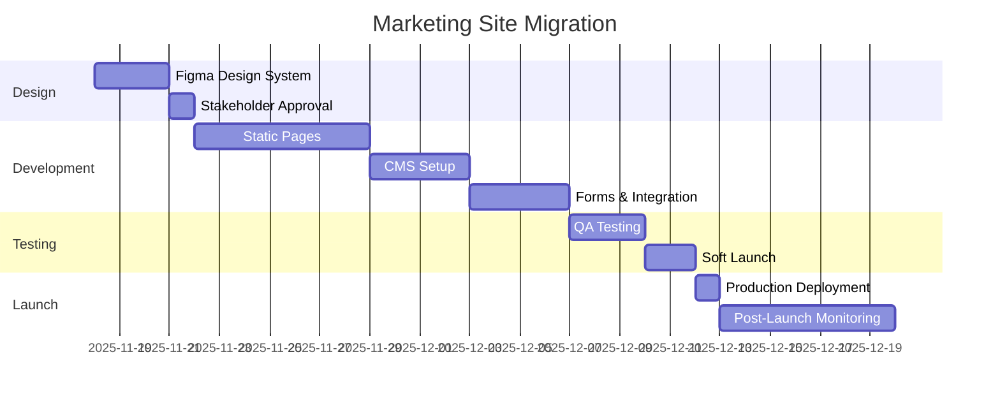

# Marketing Site Migration Strategy
**From:** intimeesolutions.com (current)
**To:** InTime v3 (Next.js 15 + shadcn/ui)
**Version:** 1.0
**Last Updated:** 2025-11-17

---

## Table of Contents
1. [Executive Summary](#executive-summary)
2. [Current Site Analysis](#current-site-analysis)
3. [Content Audit & Mapping](#content-audit--mapping)
4. [Design System Migration](#design-system-migration)
5. [Technical Migration Plan](#technical-migration-plan)
6. [SEO Preservation Strategy](#seo-preservation-strategy)
7. [Phased Rollout Plan](#phased-rollout-plan)
8. [Testing & QA Checklist](#testing--qa-checklist)
9. [Launch Checklist](#launch-checklist)

---

## Executive Summary

### Migration Goals
1. **Preserve SEO equity** - Maintain Google rankings and traffic
2. **Enhance user experience** - Modern design, faster load times
3. **Integrate with platform** - Seamless login/signup flows
4. **Enable personalization** - Dynamic content based on user type
5. **Improve conversion** - Better CTAs, streamlined funnels

### Key Metrics
| Metric | Current | Target | Success Criteria |
|--------|---------|--------|------------------|
| **Page Load Time** | ~2.5s | <1s | 60% improvement |
| **Lighthouse Score** | Unknown | 95+ | Industry leading |
| **Conversion Rate** | Unknown | +30% | Benchmark then improve |
| **Mobile Experience** | Good | Excellent | Perfect responsive design |
| **SEO Rankings** | Baseline | Maintain/Improve | Zero ranking loss |

### Timeline
- **Phase 1 (Weeks 1-2):** Design system + static pages
- **Phase 2 (Weeks 3-4):** Dynamic content + CMS integration
- **Phase 3 (Week 5):** Testing + soft launch
- **Phase 4 (Week 6):** Full launch + monitoring

---

## Current Site Analysis

### Site Structure (intimeesolutions.com)

```
/                           Homepage
├── /solutions
│   ├── /it-staffing        IT Staffing services
│   ├── /consulting         Consulting services
│   ├── /cross-border       Cross-border solutions
│   └── /training           Training programs
├── /industries             14 industry-specific pages
│   ├── /it
│   ├── /healthcare
│   ├── /engineering
│   └── ... (11 more)
├── /careers
│   ├── /join               Career opportunities
│   └── /open-positions     Job listings
├── /company
│   └── /about              About, mission, leadership
├── /resources              Blog, guides, case studies
├── /academy                Training portal (LMS)
└── /contact                Contact form
```

### Content Inventory

#### Pages to Migrate (22 total)

| Page | Word Count | Images | Forms | Priority | Notes |
|------|------------|--------|-------|----------|-------|
| **Homepage** | ~800 | 5 | 0 | Critical | Hero section, services overview |
| **/solutions/it-staffing** | ~600 | 3 | 1 | Critical | Main service offering |
| **/solutions/consulting** | ~500 | 2 | 1 | High | Secondary service |
| **/solutions/cross-border** | ~400 | 2 | 1 | High | Unique differentiator |
| **/solutions/training** | ~700 | 4 | 1 | Critical | Leads to Academy |
| **/industries/\*** | ~300 each | 1 | 1 | Medium | Template-based (14 pages) |
| **/careers/join** | ~400 | 2 | 0 | High | Talent pipeline |
| **/careers/open-positions** | Dynamic | 0 | 0 | Critical | Job board integration |
| **/company/about** | ~900 | 6 | 0 | Medium | Trust building |
| **/resources** | ~200 | 0 | 0 | Medium | Blog listing |
| **/contact** | ~100 | 0 | 1 | Critical | Lead capture |

#### Assets to Migrate
- **Logo:** `/logo8.png` → Need SVG version for Figma
- **Images:** ~50 total (compress + optimize)
- **Brand Colors:** Extract exact hex codes
- **Typography:** Identify current fonts → map to system fonts

---

## Content Audit & Mapping

### Content Categorization

#### 1. Keep As-Is (Excellent Content)
✅ Core messaging: "Transform Your Career. Power Your Business. Do It InTime."
✅ Philosophy quote: Sadhguru quote (strong brand voice)
✅ Service descriptions (clear, benefit-focused)
✅ Industry pages (well-structured)

#### 2. Enhance (Good Content, Needs Polish)
🔶 **About page** - Add team photos, more storytelling
🔶 **Training page** - Add success metrics, testimonials
🔶 **Consulting page** - Add case studies
🔶 **Resources** - Add more recent content

#### 3. Rewrite (Weak or Missing Content)
❌ **Homepage CTA** - Test multiple variations
❌ **Careers page** - Add company culture, benefits
❌ **Industries** - Add specific case studies per industry

### Content Mapping Table

| Old Page | New Route | Component | CMS? | Dynamic? |
|----------|-----------|-----------|------|----------|
| `/` | `/` | `HomePage` | No | Partial |
| `/solutions/it-staffing` | `/solutions/staffing` | `StaffingSolution` | Yes | No |
| `/solutions/consulting` | `/solutions/consulting` | `ConsultingSolution` | Yes | No |
| `/solutions/cross-border` | `/solutions/cross-border` | `CrossBorderSolution` | Yes | No |
| `/solutions/training` | `/solutions/training` | `TrainingSolution` | Yes | No |
| `/industries/*` | `/industries/[slug]` | `IndustryTemplate` | Yes | Yes |
| `/careers/join` | `/careers` | `CareersPage` | No | No |
| `/careers/open-positions` | `/jobs` | `JobBoard` | No | Yes |
| `/company/about` | `/about` | `AboutPage` | Yes | No |
| `/resources` | `/resources` | `ResourcesHub` | No | Yes |
| `/contact` | `/contact` | `ContactPage` | No | No |

---

## Design System Migration

### Current Design Tokens (Extracted)

#### Colors
```css
/* Primary Palette */
--success-green: #10B981  /* CTAs, success states */
--trust-blue: #3B82F6     /* Hover states, links */
--wisdom-gray-700: #374151 /* Footer background */
--wisdom-gray-600: #4B5563 /* Secondary backgrounds */
--wisdom-gray-400: #9CA3AF /* Tertiary text */
--wisdom-gray-300: #D1D5DB /* Secondary text */
--white: #FFFFFF          /* Primary text, backgrounds */
```

#### Typography
```
Headings: font-heading class (likely Inter or similar)
Body: System font stack
Sizes: Responsive with utility classes
```

#### Spacing
- Uses Tailwind spacing scale (4, 6, 8, 12, 16, 24, 32, 48, 64)
- Grid-based layouts with gap utilities

### Figma Design System Setup

#### 1. Color Styles
Create Figma color styles:
- **Primary/Success** → `#10B981`
- **Primary/Blue** → `#3B82F6`
- **Neutral/700** → `#374151`
- **Neutral/600** → `#4B5563`
- **Neutral/400** → `#9CA3AF`
- **Neutral/300** → `#D1D5DB`
- **Background/White** → `#FFFFFF`
- **Background/Dark** → `#111827`

#### 2. Typography Styles
Map to shadcn/ui typography:
- **H1:** 4xl (36px) / Bold / Leading tight
- **H2:** 3xl (30px) / Bold / Leading tight
- **H3:** 2xl (24px) / Semibold / Leading snug
- **H4:** xl (20px) / Semibold / Leading snug
- **Body Large:** base (16px) / Regular / Leading relaxed
- **Body:** sm (14px) / Regular / Leading normal
- **Caption:** xs (12px) / Regular / Leading tight

#### 3. Component Library
Create Figma components for:

**Atoms:**
- Buttons (primary, secondary, outline, ghost)
- Input fields (text, email, tel, textarea)
- Select dropdowns
- Checkboxes / Radio buttons
- Badges / Tags
- Icons (Lucide React)

**Molecules:**
- Cards (service, industry, blog post)
- Form groups (label + input + error)
- Navigation items
- CTAs with icons
- Metric displays (500+ consultants, 95% success)

**Organisms:**
- Hero sections (homepage, internal pages)
- Service grids
- Industry cards grid
- Footer (multi-column)
- Navigation (desktop + mobile)
- Contact forms

#### 4. Layouts
Create responsive artboards:
- **Desktop:** 1440px (design width)
- **Tablet:** 768px
- **Mobile:** 375px (iPhone size)

---

## Technical Migration Plan

### Phase 1: Static Marketing Site (Weeks 1-2)

#### Step 1: Set Up Next.js Structure
```bash
# Create marketing site structure
mkdir -p src/app/(marketing)/{solutions,industries,careers,about,resources,contact}
mkdir -p src/components/marketing/{hero,services,industries,testimonials,cta}
mkdir -p src/lib/content
```

#### Step 2: Create Layout Components
```typescript
// src/app/(marketing)/layout.tsx
import { MarketingNav } from '@/components/marketing/nav'
import { MarketingFooter } from '@/components/marketing/footer'

export default function MarketingLayout({
  children,
}: {
  children: React.ReactNode
}) {
  return (
    <>
      <MarketingNav />
      <main className="min-h-screen">
        {children}
      </main>
      <MarketingFooter />
    </>
  )
}
```

#### Step 3: Implement shadcn/ui Components
```bash
# Install required shadcn/ui components
pnpm dlx shadcn@latest add button card input textarea select badge separator
```

#### Step 4: Create Reusable Marketing Components

**Hero Component:**
```typescript
// src/components/marketing/hero/PageHero.tsx
interface PageHeroProps {
  title: string
  subtitle: string
  primaryCTA: { text: string; href: string }
  secondaryCTA?: { text: string; href: string }
  backgroundImage?: string
}

export function PageHero({ title, subtitle, primaryCTA, secondaryCTA, backgroundImage }: PageHeroProps) {
  return (
    <section className="relative py-24 sm:py-32">
      {backgroundImage && (
        <div className="absolute inset-0 -z-10">
          <Image src={backgroundImage} alt="" fill className="object-cover opacity-20" />
        </div>
      )}
      <div className="container">
        <h1 className="text-4xl font-bold tracking-tight sm:text-6xl">
          {title}
        </h1>
        <p className="mt-6 text-lg leading-8 text-gray-300">
          {subtitle}
        </p>
        <div className="mt-10 flex items-center gap-x-6">
          <Button asChild size="lg">
            <Link href={primaryCTA.href}>{primaryCTA.text}</Link>
          </Button>
          {secondaryCTA && (
            <Button asChild variant="outline" size="lg">
              <Link href={secondaryCTA.href}>{secondaryCTA.text}</Link>
            </Button>
          )}
        </div>
      </div>
    </section>
  )
}
```

**Service Card:**
```typescript
// src/components/marketing/services/ServiceCard.tsx
interface ServiceCardProps {
  icon: React.ReactNode
  title: string
  description: string
  features: string[]
  cta: { text: string; href: string }
}

export function ServiceCard({ icon, title, description, features, cta }: ServiceCardProps) {
  return (
    <Card className="p-6 hover:shadow-lg transition-shadow">
      <div className="mb-4">{icon}</div>
      <h3 className="text-xl font-semibold mb-2">{title}</h3>
      <p className="text-gray-400 mb-4">{description}</p>
      <ul className="space-y-2 mb-6">
        {features.map((feature, i) => (
          <li key={i} className="flex items-start gap-2">
            <Check className="h-5 w-5 text-green-500 shrink-0 mt-0.5" />
            <span className="text-sm">{feature}</span>
          </li>
        ))}
      </ul>
      <Button asChild variant="outline" className="w-full">
        <Link href={cta.href}>{cta.text}</Link>
      </Button>
    </Card>
  )
}
```

### Phase 2: Dynamic Content + CMS (Weeks 3-4)

#### Option A: MDX for Simple Content
```bash
# Install MDX support
pnpm add @next/mdx @mdx-js/loader @mdx-js/react @types/mdx
```

Structure:
```
src/content/
├── solutions/
│   ├── staffing.mdx
│   ├── consulting.mdx
│   └── cross-border.mdx
├── industries/
│   ├── it.mdx
│   ├── healthcare.mdx
│   └── ... (14 files)
└── resources/
    └── blog/
        ├── post-1.mdx
        └── ...
```

#### Option B: Supabase CMS (Recommended)
```sql
-- Create CMS tables
CREATE TABLE marketing_pages (
  id UUID PRIMARY KEY DEFAULT gen_random_uuid(),
  slug TEXT UNIQUE NOT NULL,
  title TEXT NOT NULL,
  subtitle TEXT,
  content JSONB NOT NULL, -- Structured content blocks
  seo_title TEXT,
  seo_description TEXT,
  og_image TEXT,
  published_at TIMESTAMPTZ,
  created_at TIMESTAMPTZ DEFAULT NOW(),
  updated_at TIMESTAMPTZ DEFAULT NOW()
);

CREATE TABLE blog_posts (
  id UUID PRIMARY KEY DEFAULT gen_random_uuid(),
  slug TEXT UNIQUE NOT NULL,
  title TEXT NOT NULL,
  excerpt TEXT,
  content TEXT NOT NULL, -- MDX content
  author_id UUID REFERENCES users(id),
  featured_image TEXT,
  tags TEXT[],
  published_at TIMESTAMPTZ,
  created_at TIMESTAMPTZ DEFAULT NOW()
);
```

Fetch content:
```typescript
// src/lib/cms/getPage.ts
export async function getMarketingPage(slug: string) {
  const { data, error } = await supabase
    .from('marketing_pages')
    .select('*')
    .eq('slug', slug)
    .single()

  if (error) throw error
  return data
}
```

### Phase 3: Forms & Lead Capture (Week 4)

#### Contact Form with Validation
```typescript
// src/app/(marketing)/contact/ContactForm.tsx
const contactSchema = z.object({
  name: z.string().min(1, 'Name is required'),
  email: z.string().email('Invalid email'),
  phone: z.string().optional(),
  company: z.string().optional(),
  type: z.enum(['talent', 'company', 'training', 'other']),
  message: z.string().min(10, 'Message must be at least 10 characters'),
})

export function ContactForm() {
  const [isSubmitting, setIsSubmitting] = useState(false)
  const form = useForm<z.infer<typeof contactSchema>>({
    resolver: zodResolver(contactSchema),
  })

  async function onSubmit(data: z.infer<typeof contactSchema>) {
    setIsSubmitting(true)
    // Server action
    const result = await submitContactForm(data)
    if (result.success) {
      toast.success('Message sent! We\'ll be in touch soon.')
      form.reset()
    } else {
      toast.error('Something went wrong. Please try again.')
    }
    setIsSubmitting(false)
  }

  return (
    <Form {...form}>
      <form onSubmit={form.handleSubmit(onSubmit)} className="space-y-6">
        {/* Form fields */}
      </form>
    </Form>
  )
}
```

#### Server Action
```typescript
// src/app/(marketing)/contact/actions.ts
'use server'

export async function submitContactForm(data: ContactFormData) {
  // Validate
  const validated = contactSchema.parse(data)

  // Save to database
  const { error } = await supabase
    .from('contact_submissions')
    .insert({
      ...validated,
      source: 'website',
      status: 'new',
    })

  if (error) {
    return { success: false, error: error.message }
  }

  // Send notification email (Resend)
  await sendEmail({
    to: 'info@intimeesolutions.com',
    subject: `New Contact: ${validated.name}`,
    template: 'contact-notification',
    data: validated,
  })

  return { success: true }
}
```

---

## SEO Preservation Strategy

### 1. URL Mapping (301 Redirects)

```typescript
// next.config.js
module.exports = {
  async redirects() {
    return [
      // Keep all URLs that can stay the same
      // Redirect changed URLs
      {
        source: '/careers/join',
        destination: '/careers',
        permanent: true,
      },
      {
        source: '/careers/open-positions',
        destination: '/jobs',
        permanent: true,
      },
      // Add more as needed
    ]
  },
}
```

### 2. Metadata Preservation

```typescript
// src/app/(marketing)/solutions/staffing/page.tsx
export const metadata: Metadata = {
  title: 'IT Staffing Services | InTime eSolutions',
  description: 'Transform your IT staffing with our 24-hour guarantee. Contract, Contract-to-Hire, and Direct Placement across all technologies.',
  keywords: 'IT staffing, technology recruiting, contract staffing, direct hire',
  openGraph: {
    title: 'IT Staffing Services | InTime eSolutions',
    description: 'Transform your IT staffing with our 24-hour guarantee.',
    images: ['/og-images/staffing.jpg'],
  },
}
```

### 3. Structured Data (JSON-LD)

```typescript
// src/components/marketing/seo/OrganizationSchema.tsx
export function OrganizationSchema() {
  const schema = {
    '@context': 'https://schema.org',
    '@type': 'Organization',
    name: 'InTime eSolutions',
    url: 'https://www.intimeesolutions.com',
    logo: 'https://www.intimeesolutions.com/logo.png',
    description: 'Transform Your Career. Power Your Business. Do It InTime.',
    contactPoint: [
      {
        '@type': 'ContactPoint',
        telephone: '+1-307-650-2850',
        contactType: 'customer service',
        areaServed: 'US',
      },
      {
        '@type': 'ContactPoint',
        telephone: '+1-289-236-9000',
        contactType: 'customer service',
        areaServed: 'CA',
      },
    ],
    sameAs: [
      'https://www.linkedin.com/company/intime-esolutions',
      // Add other social profiles
    ],
  }

  return (
    <script
      type="application/ld+json"
      dangerouslySetInnerHTML={{ __html: JSON.stringify(schema) }}
    />
  )
}
```

### 4. Sitemap Generation

```typescript
// src/app/sitemap.ts
export default async function sitemap(): Promise<MetadataRoute.Sitemap> {
  // Static pages
  const routes = [
    '',
    '/solutions/staffing',
    '/solutions/consulting',
    '/solutions/cross-border',
    '/solutions/training',
    '/about',
    '/careers',
    '/contact',
  ].map(route => ({
    url: `https://www.intimeesolutions.com${route}`,
    lastModified: new Date(),
    changeFrequency: 'monthly' as const,
    priority: route === '' ? 1 : 0.8,
  }))

  // Dynamic industry pages
  const industries = await getIndustries()
  const industryRoutes = industries.map(industry => ({
    url: `https://www.intimeesolutions.com/industries/${industry.slug}`,
    lastModified: new Date(),
    changeFrequency: 'monthly' as const,
    priority: 0.6,
  }))

  return [...routes, ...industryRoutes]
}
```

---

## Phased Rollout Plan

### Week 1-2: Foundation & Design

#### Day 1-3: Design System
- [ ] Extract exact colors from current site
- [ ] Create Figma design system
- [ ] Design 3 key pages (home, staffing, contact)
- [ ] Get stakeholder approval

#### Day 4-7: Static Implementation
- [ ] Set up Next.js marketing routes
- [ ] Implement shadcn/ui components
- [ ] Build homepage
- [ ] Build solutions pages (4 pages)

#### Day 8-10: Additional Pages
- [ ] About page
- [ ] Careers page
- [ ] Contact page
- [ ] Footer with all links

### Week 3-4: Dynamic Content & CMS

#### Day 11-14: CMS Setup
- [ ] Create Supabase CMS tables
- [ ] Build admin interface (optional: use Supabase Studio)
- [ ] Migrate content to CMS
- [ ] Test dynamic page rendering

#### Day 15-18: Forms & Integrations
- [ ] Contact form with validation
- [ ] Lead capture to Supabase
- [ ] Email notifications (Resend)
- [ ] Job board integration

### Week 5: Testing & Soft Launch

#### Day 19-21: Testing
- [ ] Lighthouse audits (all pages 95+)
- [ ] Cross-browser testing (Chrome, Safari, Firefox, Edge)
- [ ] Mobile responsiveness (iOS, Android)
- [ ] Form submission testing
- [ ] SEO validation (metadata, structured data)
- [ ] Load testing

#### Day 22-23: Soft Launch
- [ ] Deploy to Vercel preview
- [ ] Internal team testing
- [ ] Fix critical issues
- [ ] Get final approval

### Week 6: Full Launch

#### Day 24: Pre-Launch
- [ ] Final content review
- [ ] DNS setup (if new domain)
- [ ] SSL certificates
- [ ] Analytics setup (Google Analytics, Plausible)
- [ ] Error monitoring (Sentry)

#### Day 25: Launch Day
- [ ] Deploy to production
- [ ] Update DNS (if needed)
- [ ] Monitor analytics
- [ ] Monitor errors
- [ ] Be on standby for issues

#### Day 26-30: Post-Launch
- [ ] Daily analytics review
- [ ] SEO ranking checks
- [ ] User feedback collection
- [ ] Performance optimization
- [ ] Content tweaks based on data

---

## Testing & QA Checklist

### Performance Testing

| Test | Tool | Target | Priority |
|------|------|--------|----------|
| **Page Speed** | Lighthouse | 95+ | Critical |
| **First Contentful Paint** | Lighthouse | <1.8s | Critical |
| **Largest Contentful Paint** | Lighthouse | <2.5s | Critical |
| **Time to Interactive** | Lighthouse | <3.8s | High |
| **Cumulative Layout Shift** | Lighthouse | <0.1 | High |
| **Total Blocking Time** | Lighthouse | <300ms | Medium |

### Functionality Testing

**Forms:**
- [ ] Contact form validation works
- [ ] Contact form submits to database
- [ ] Email notifications sent
- [ ] Error states display correctly
- [ ] Success states display correctly

**Navigation:**
- [ ] All links work (no 404s)
- [ ] Mobile menu opens/closes
- [ ] Dropdowns work (if any)
- [ ] Footer links all work
- [ ] CTA buttons link correctly

**Content:**
- [ ] All images load
- [ ] All images have alt text
- [ ] No Lorem ipsum text
- [ ] No broken internal links
- [ ] Phone numbers are clickable (tel: links)
- [ ] Email addresses are clickable (mailto: links)

### Browser Testing

Test in:
- [ ] Chrome (latest)
- [ ] Safari (latest)
- [ ] Firefox (latest)
- [ ] Edge (latest)
- [ ] Safari iOS (latest)
- [ ] Chrome Android (latest)

### Device Testing

Test on:
- [ ] Desktop (1920×1080, 1440×900)
- [ ] Laptop (1366×768)
- [ ] Tablet (iPad, 768×1024)
- [ ] Mobile (iPhone, 375×667)
- [ ] Mobile (Android, 360×640)

### SEO Testing

- [ ] All pages have unique titles
- [ ] All pages have meta descriptions
- [ ] All pages have og:image
- [ ] Sitemap generated correctly
- [ ] robots.txt configured
- [ ] 301 redirects working
- [ ] Canonical URLs set
- [ ] Structured data valid (test with Google Rich Results)

### Accessibility Testing

- [ ] Keyboard navigation works
- [ ] Focus states visible
- [ ] ARIA labels on interactive elements
- [ ] Color contrast ratio 4.5:1+ (WCAG AA)
- [ ] Images have alt text
- [ ] Headings in logical order
- [ ] Forms have labels

---

## Launch Checklist

### Pre-Launch (1 Day Before)

**Technical:**
- [ ] Final build succeeds
- [ ] All tests passing
- [ ] No console errors
- [ ] Analytics tracking ID configured
- [ ] Sentry DSN configured
- [ ] Environment variables set

**Content:**
- [ ] All placeholder content replaced
- [ ] Legal pages (Privacy, Terms) updated
- [ ] Contact information verified
- [ ] Phone numbers tested
- [ ] Email addresses tested

**DNS/Hosting:**
- [ ] Vercel project created
- [ ] Custom domain configured
- [ ] SSL certificate valid
- [ ] WWW redirect working

### Launch Day

**Deployment:**
- [ ] Deploy to production
- [ ] Verify production build
- [ ] Check all pages load
- [ ] Test forms in production
- [ ] Verify analytics tracking

**Monitoring:**
- [ ] Check Sentry for errors
- [ ] Monitor Google Analytics real-time
- [ ] Check server logs
- [ ] Test from multiple devices

### Post-Launch (First Week)

**Daily:**
- [ ] Check analytics (traffic, conversions)
- [ ] Check error logs
- [ ] Monitor page speed
- [ ] Review user feedback

**Weekly:**
- [ ] SEO rankings check (Google Search Console)
- [ ] Conversion rate analysis
- [ ] Heatmap review (if using Hotjar/Clarity)
- [ ] Performance audit

---

## Migration Timeline Summary



**Total Duration:** 6 weeks
**Critical Path:** Design → Development → Testing → Launch

---

## Success Metrics

### Week 1 Post-Launch

| Metric | Baseline | Target |
|--------|----------|--------|
| **Avg Page Load Time** | Current | <1s |
| **Lighthouse Score** | Unknown | 95+ |
| **Organic Traffic** | Current | Maintain |
| **Bounce Rate** | Current | <50% |
| **Contact Form Submissions** | Current | +20% |

### Month 1 Post-Launch

| Metric | Baseline | Target |
|--------|----------|--------|
| **Organic Traffic** | Current | +10% |
| **Conversion Rate** | Current | +30% |
| **Page Views/Session** | Current | +15% |
| **Avg Session Duration** | Current | +20% |
| **SEO Rankings** | Current | Maintain/Improve |

---

## Rollback Plan

If critical issues arise:

1. **Immediate Rollback:** Revert DNS to old site (5 min)
2. **Fix Forward:** Fix issue and redeploy (prefer this)
3. **Partial Rollback:** Redirect specific pages to old site temporarily

**Rollback Triggers:**
- Site completely down (>5 min)
- SEO rankings drop >20% (monitor daily)
- Conversion rate drops >50% (first 3 days)
- Critical functionality broken (forms, navigation)

---

## Next Steps

1. **Review this document** with stakeholders
2. **Get Figma design approval** before development
3. **Create content migration spreadsheet** (assign owners)
4. **Set up staging environment** for testing
5. **Begin Phase 1** (Design system + static pages)

---

**Document Owner:** Migration Team
**Review Cycle:** Weekly during migration
**Last Updated:** 2025-11-17
