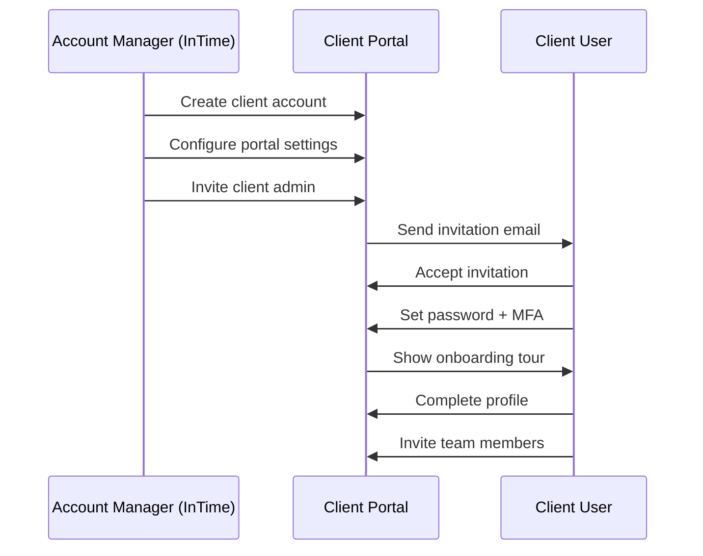
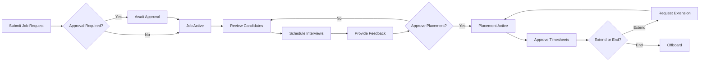

# Client Portal User - Role Overview

**Document Version:** 1.0
**Last Updated:** 2025-11-30
**Role Type:** External User (Client-Side)
**Access Level:** Limited Self-Service Portal

---

## Table of Contents

1. [Role Summary](#role-summary)
2. [Role Hierarchy](#role-hierarchy)
3. [Portal Capabilities](#portal-capabilities)
4. [Security & Access Control](#security--access-control)
5. [Key Workflows](#key-workflows)
6. [Integration Points](#integration-points)
7. [International Considerations](#international-considerations)
8. [Compliance & Legal](#compliance--legal)

---

## Role Summary

### Overview

Client Portal Users are **external stakeholders** from client organizations who use InTime's self-service portal to manage their staffing needs. Unlike internal InTime employees, these users have limited, scoped access to only their organization's data.

**Primary Purpose:**
- Submit and track job requests
- Review candidate submissions
- Schedule and manage interviews
- Approve placements and timesheets
- Access analytics and reports

**Organizational Context:**
- Employed by client companies (not InTime)
- Interact with InTime Account Managers
- May have varying levels of authority within their organization
- Require secure, isolated data access

### Role IDs

```typescript
// Base portal access
'client_user'          // Standard portal user
'hiring_manager'       // Can submit jobs, review candidates
'client_admin'         // Can manage team, configure settings
'procurement_manager'  // Focus on spend, contracts, compliance
'hr_contact'           // Focus on candidate experience, onboarding
```

### Typical Job Titles

- Hiring Manager
- Technical Lead
- Department Head
- Procurement Manager
- Vendor Manager
- HR Business Partner
- Talent Acquisition Specialist
- Engineering Manager
- Project Manager
- Program Manager

---

## Role Hierarchy

### Client Organization Structure

```
┌─────────────────────────────────────┐
│     Client Admin                    │
│  - Full portal configuration        │
│  - User management                  │
│  - Billing visibility               │
└──────────────┬──────────────────────┘
               │
         ┌─────┴─────┬─────────────┬──────────────┐
         │           │             │              │
    ┌────▼────┐ ┌────▼────┐  ┌────▼────┐   ┌────▼────┐
    │ Hiring  │ │Procure- │  │   HR    │   │Technical│
    │ Manager │ │  ment   │  │ Contact │   │  Lead   │
    └─────────┘ └─────────┘  └─────────┘   └─────────┘
```

### Permission Levels

| Level | Capabilities | Restrictions |
|-------|-------------|--------------|
| **Client Admin** | Manage users, configure workflows, view all data | Cannot access other clients' data |
| **Hiring Manager** | Submit jobs, review candidates, schedule interviews | Own jobs only |
| **Procurement Manager** | View spend, manage contracts, approve invoices | Financial focus only |
| **HR Contact** | Review candidates, track onboarding, provide feedback | Candidate experience focus |
| **Technical Lead** | Technical screening, interview participation | Limited administrative access |

### Multi-Level Approval

```typescript
interface ApprovalWorkflow {
  clientId: string;
  workflowType: 'job_approval' | 'placement_approval' | 'spend_approval';
  levels: Array<{
    level: number;
    approverRole: string;
    approvalLimit?: number; // For spend approvals
    requiredCount: number;  // How many approvers needed
  }>;
}

// Example: Job Request Approval
{
  clientId: 'client-123',
  workflowType: 'job_approval',
  levels: [
    { level: 1, approverRole: 'hiring_manager', requiredCount: 1 },
    { level: 2, approverRole: 'procurement_manager', requiredCount: 1 },
    { level: 3, approverRole: 'client_admin', requiredCount: 1 }
  ]
}
```

---

## Portal Capabilities

### 1. Job Management

**Submit Job Requests**
- Use pre-approved templates
- Custom job specifications
- Attach supporting documents
- Set urgency/priority levels
- Track approval status

**Track Job Orders**
- Real-time status updates
- Candidate submission notifications
- Pipeline visibility
- Time-to-fill metrics
- Communication history

**Modify Job Requirements**
- Request changes to active jobs
- Update priority/urgency
- Extend/close jobs
- Provide feedback on candidate quality

### 2. Candidate Review

**View Submissions**
- Shortlisted candidates only
- Detailed profiles and resumes
- Skills assessment results
- Interview feedback history
- Availability information

**Provide Feedback**
- Rate candidates (1-5 stars)
- Written feedback
- Rejection reasons
- Request additional information
- Schedule next steps

**Download Materials**
- Candidate resumes (PDF)
- Assessment reports
- Reference letters
- Compliance documents
- Background check results

### 3. Interview Management

**Schedule Interviews**
- Calendar integration (Google, Outlook)
- Set availability windows
- Invite team members
- Choose interview format (phone, video, onsite)
- Send automated invitations

**Conduct Interviews**
- Video conferencing links
- Interview guides/questions
- Evaluation forms
- Real-time note-taking
- Recording options (with consent)

**Post-Interview Actions**
- Submit feedback immediately
- Rate candidate performance
- Recommend next steps
- Request follow-up interviews
- Approve for placement

### 4. Placement Management

**Approve Placements**
- Review final candidate profiles
- Approve contract terms
- Set start date
- Assign onboarding buddy
- Configure access/systems

**Monitor Active Placements**
- Consultant performance dashboard
- Timesheet review and approval
- Extension requests
- Performance feedback
- Issue escalation

**Offboard Consultants**
- End assignment
- Provide exit feedback
- Request rehire in future
- Archive placement data

### 5. Analytics & Reporting

**Standard Reports**
- Spend by department/project
- Placement history
- Time-to-fill trends
- Candidate quality metrics
- Invoice history

**Custom Reports**
- Build custom queries
- Export to Excel/PDF
- Schedule automated delivery
- Share with team
- Save report templates

**Dashboards**
- Active jobs overview
- Pending approvals
- Upcoming interviews
- Active placements
- Budget tracking

### 6. Team Collaboration

**User Management** (Client Admin only)
- Invite team members
- Assign roles/permissions
- Deactivate users
- Audit user activity

**Internal Communication**
- Comment on jobs/candidates
- Tag team members
- Private notes
- Activity feed
- Email notifications

**Workflow Configuration** (Client Admin only)
- Set approval workflows
- Configure notification preferences
- Customize job templates
- Set budget thresholds

---

## Security & Access Control

### Data Isolation

**Strict Tenant Isolation**
```typescript
// Every query must filter by client_id
const jobs = await db.query.jobs.findMany({
  where: eq(jobs.clientId, session.user.clientId),
  // Client users NEVER see other clients' data
});

// Row-level security policy
CREATE POLICY "client_users_own_data" ON jobs
  FOR ALL USING (
    client_id = current_setting('app.current_client_id')::uuid
  );
```

**Permission Scopes**
```typescript
interface ClientUserPermissions {
  // Jobs
  'job:submit': boolean;          // Submit new job requests
  'job:view_own': boolean;        // View own submitted jobs
  'job:view_all': boolean;        // View all org's jobs (admin)
  'job:edit': boolean;            // Edit job details
  'job:close': boolean;           // Close/cancel jobs

  // Candidates
  'candidate:view': boolean;      // View submitted candidates
  'candidate:feedback': boolean;  // Provide feedback
  'candidate:download': boolean;  // Download resumes/docs

  // Interviews
  'interview:schedule': boolean;  // Schedule interviews
  'interview:reschedule': boolean;
  'interview:cancel': boolean;
  'interview:feedback': boolean;  // Submit interview feedback

  // Placements
  'placement:approve': boolean;   // Approve candidate placement
  'placement:manage': boolean;    // Manage active placements
  'timesheet:approve': boolean;   // Approve timesheets
  'placement:extend': boolean;    // Request extensions

  // Analytics
  'report:view_own': boolean;     // View own department reports
  'report:view_all': boolean;     // View org-wide reports (admin)
  'report:export': boolean;       // Export data
  'report:custom': boolean;       // Build custom reports

  // Administration
  'user:invite': boolean;         // Invite team members
  'user:manage': boolean;         // Manage user roles
  'settings:configure': boolean;  // Configure workflows
  'billing:view': boolean;        // View invoices/spend
}
```

### Authentication Methods

**SSO Integration** (Enterprise clients)
- SAML 2.0
- OAuth 2.0 / OpenID Connect
- Azure AD
- Okta
- Google Workspace
- Custom LDAP

**Standard Authentication**
- Email + Password
- Two-factor authentication (required)
- Magic link login
- Password reset flow

**Session Management**
```typescript
interface ClientSession {
  userId: string;
  clientId: string;              // Tenant isolation
  roleId: string;
  permissions: string[];
  organizationId?: string;       // Sub-org within client
  departmentId?: string;         // Department context
  sessionTimeout: number;        // 30 minutes idle
  mfaVerified: boolean;
  ssoProvider?: string;
}
```

### IP Whitelisting (Enterprise Feature)

```typescript
interface IPWhitelist {
  clientId: string;
  enabled: boolean;
  allowedRanges: Array<{
    cidr: string;              // e.g., '203.0.113.0/24'
    description: string;       // e.g., 'Corporate HQ'
    createdAt: Date;
  }>;
  blockUnknownIPs: boolean;   // Reject or warn?
}
```

### Audit Logging

**All Client Actions Logged**
```typescript
interface ClientAuditLog {
  id: string;
  clientId: string;
  userId: string;
  action: string;               // 'job.submit', 'candidate.view', etc.
  resourceType: string;         // 'job', 'candidate', 'placement'
  resourceId: string;
  metadata: Record<string, any>;
  ipAddress: string;
  userAgent: string;
  timestamp: Date;
}

// Examples of logged actions
'job.submit'
'job.view'
'job.edit'
'candidate.view'
'candidate.download_resume'
'interview.schedule'
'placement.approve'
'timesheet.approve'
'report.export'
'user.invite'
'settings.change'
```

---

## Key Workflows

### 1. Account Setup & Onboarding



**Detailed Steps:** See `01-portal-onboarding.md`

### 2. Job Request to Placement



**Detailed Workflows:**
- Job Submission: `02-submit-job-request.md`
- Candidate Review: `03-review-candidates.md`
- Interview Scheduling: `04-schedule-interviews.md`
- Placement Management: `05-manage-placements.md`

### 3. Timesheet Approval

```typescript
interface TimesheetApprovalWorkflow {
  placementId: string;
  period: { start: Date; end: Date };
  consultant: string;
  hours: number;
  status: 'pending' | 'approved' | 'disputed' | 'rejected';
  approver?: string;
  approvedAt?: Date;
  notes?: string;
}

// Workflow steps
'submitted' →       // Consultant submits timesheet
'pending_review' →  // Client receives notification
'approved' →        // Client approves hours
'processed'         // InTime generates invoice
```

### 4. Escalation Process

```typescript
interface Escalation {
  id: string;
  clientId: string;
  raisedBy: string;              // Client user ID
  type: 'quality' | 'performance' | 'billing' | 'other';
  priority: 'low' | 'medium' | 'high' | 'critical';
  subject: string;
  description: string;
  relatedTo?: {
    type: 'job' | 'candidate' | 'placement';
    id: string;
  };
  assignedTo?: string;           // InTime Account Manager
  status: 'open' | 'in_progress' | 'resolved' | 'closed';
  resolution?: string;
  createdAt: Date;
  resolvedAt?: Date;
  slaDeadline: Date;
}
```

---

## Integration Points

### 1. Calendar Systems

**Supported Providers**
- Google Calendar
- Microsoft Outlook/Exchange
- Apple Calendar (CalDAV)
- Custom iCal feeds

**Integration Features**
- OAuth 2.0 authentication
- Real-time availability sync
- Automatic meeting creation
- Cancellation/update sync
- Timezone handling

**Implementation**
```typescript
interface CalendarIntegration {
  userId: string;
  provider: 'google' | 'microsoft' | 'apple';
  accessToken: string;
  refreshToken: string;
  calendarId: string;
  syncEnabled: boolean;
  lastSyncAt?: Date;
}

// Create interview event
async function scheduleInterview(details: InterviewDetails) {
  const integration = await getCalendarIntegration(userId);

  const event = await createCalendarEvent({
    provider: integration.provider,
    summary: `Interview: ${candidate.name}`,
    start: details.startTime,
    end: details.endTime,
    attendees: [candidate.email, ...interviewers],
    location: details.location || 'Video Call',
    conferenceData: details.videoLink,
    description: generateInterviewDetails(details)
  });

  return event;
}
```

### 2. Single Sign-On (SSO)

**SAML 2.0 Flow**
```typescript
interface SAMLConfig {
  clientId: string;
  entityId: string;              // Identity Provider entity ID
  ssoUrl: string;                // SSO endpoint
  x509Certificate: string;       // IdP public certificate
  attributeMapping: {
    email: string;               // SAML attribute for email
    firstName: string;
    lastName: string;
    department?: string;
    role?: string;
  };
  enforceSSO: boolean;           // Disable password login?
}

// SSO login flow
1. User clicks "Login with SSO"
2. Portal redirects to IdP with SAML request
3. User authenticates at IdP
4. IdP redirects back with SAML assertion
5. Portal validates assertion
6. Portal creates/updates user session
7. User lands on dashboard
```

**OAuth 2.0 / OIDC Flow**
```typescript
interface OAuthConfig {
  clientId: string;
  clientSecret: string;
  authorizationUrl: string;
  tokenUrl: string;
  userInfoUrl: string;
  scopes: string[];              // e.g., ['openid', 'email', 'profile']
  redirectUri: string;
}
```

### 3. HR Systems (Future)

**Planned Integrations**
- Workday
- SuccessFactors
- BambooHR
- ADP Workforce Now

**Data Sync**
- Employee/department data
- Organizational hierarchy
- Budget/cost center codes
- Requisition approval chains

### 4. Procurement/VMS Systems

**Vendor Management Systems**
- Fieldglass
- Beeline
- PeopleFluent
- Ariba

**Integration Points**
- Job requisition sync
- Candidate submission
- Timesheet/invoice export
- Compliance document exchange

---

## International Considerations

### Multi-Language Support

**Supported Languages** (Phase 1)
- English (US, UK, AU)
- Spanish (ES, MX)
- French (FR, CA)
- German (DE)
- Portuguese (BR)
- Japanese (JP)
- Mandarin (CN)

**Localization Strategy**
```typescript
interface PortalLocalization {
  language: string;              // ISO 639-1 code
  region: string;                // ISO 3166-1 code
  currency: string;              // ISO 4217 code
  dateFormat: string;            // e.g., 'MM/DD/YYYY', 'DD/MM/YYYY'
  timeFormat: '12h' | '24h';
  timezone: string;              // IANA timezone
  numberFormat: {
    decimalSeparator: string;    // '.' or ','
    thousandsSeparator: string;  // ',' or '.' or ' '
  };
}

// User preferences
const locale = {
  language: 'fr',
  region: 'FR',
  currency: 'EUR',
  dateFormat: 'DD/MM/YYYY',
  timeFormat: '24h',
  timezone: 'Europe/Paris',
  numberFormat: {
    decimalSeparator: ',',
    thousandsSeparator: ' '
  }
};
```

### Regional Compliance

**GDPR (EU/UK)**
- Consent management
- Right to access data
- Right to erasure
- Data portability
- Breach notification (72 hours)

**CCPA (California)**
- Privacy notice at collection
- Opt-out of data sale
- Access and deletion rights
- Non-discrimination

**Data Residency**
```typescript
interface DataResidency {
  clientId: string;
  region: 'US' | 'EU' | 'UK' | 'APAC' | 'CA';
  dataCenter: string;            // e.g., 'us-east-1', 'eu-central-1'
  restrictDataTransfer: boolean; // Prevent data leaving region
  complianceFrameworks: string[]; // ['GDPR', 'SOC2', 'ISO27001']
}
```

### Currency & Billing

**Multi-Currency Support**
```typescript
interface CurrencyPreference {
  clientId: string;
  displayCurrency: string;       // ISO 4217
  billingCurrency: string;       // May differ from display
  exchangeRateSource: 'daily' | 'monthly' | 'contract';
  showOriginalCurrency: boolean; // Show USD alongside local
}

// Example: German client
{
  displayCurrency: 'EUR',
  billingCurrency: 'EUR',
  exchangeRateSource: 'monthly', // Fixed monthly rate
  showOriginalCurrency: true     // Show "€120 (≈$130 USD)"
}
```

### Timezone Handling

**Interview Scheduling Across Timezones**
```typescript
interface InterviewSchedule {
  interviewId: string;
  startTime: Date;               // Stored in UTC
  duration: number;              // Minutes
  clientTimezone: string;        // Hiring manager's timezone
  candidateTimezone: string;     // Candidate's timezone
  recruiterTimezone: string;     // InTime recruiter's timezone
}

// Display logic
function formatInterviewTime(schedule: InterviewSchedule, userTimezone: string) {
  return {
    utc: schedule.startTime.toISOString(),
    local: formatInTimeZone(schedule.startTime, userTimezone, 'PPpp'),
    // Example: "Jan 15, 2025, 2:00 PM EST (7:00 PM GMT)"
    formatted: `${formatInTimeZone(schedule.startTime, userTimezone, 'PPpp')} ${userTimezone}`
  };
}
```

---

## Compliance & Legal

### Terms of Service

**Client-Specific ToS**
- Portal usage terms
- Data processing agreement (DPA)
- Service level agreement (SLA)
- Confidentiality obligations
- Intellectual property rights

**Acceptance Tracking**
```typescript
interface ToSAcceptance {
  userId: string;
  clientId: string;
  tosVersion: string;
  acceptedAt: Date;
  ipAddress: string;
  userAgent: string;
}

// Force re-acceptance on updates
if (currentToSVersion !== user.acceptedToSVersion) {
  // Show ToS modal before portal access
  showToSModal();
}
```

### Data Processing Agreement (GDPR)

**Required Elements**
- Subject matter and duration
- Nature and purpose of processing
- Type of personal data
- Categories of data subjects
- Rights and obligations of parties
- Sub-processor list
- Data deletion procedures

**Example Clauses**
```markdown
### Data Processing Terms

**1. Data Controller vs. Processor**
- Client acts as Data Controller
- InTime acts as Data Processor
- Processing limited to staffing services

**2. Data Types Processed**
- Candidate personal data (name, contact, resume)
- Interview feedback and notes
- Timesheet and performance data
- Communication records

**3. Data Retention**
- Active placement data: Retained while placement active
- Historical data: Retained per contract (typically 7 years)
- Candidate data: Deleted 30 days after job closure (unless placed)
```

### Background Check Compliance

**FCRA Compliance** (US)
- Written authorization required
- Pre-adverse action notice
- Copy of report to candidate
- Dispute resolution process

**Implementation**
```typescript
interface BackgroundCheckConsent {
  candidateId: string;
  clientId: string;
  jobId: string;
  consentGiven: boolean;
  consentDate: Date;
  consentMethod: 'electronic' | 'paper';
  signature: string;            // Electronic signature
  ipAddress: string;
  acknowledgedRights: boolean;  // FCRA summary of rights
}
```

### Export Control (International Placements)

**Visa/Work Authorization**
```typescript
interface WorkAuthorization {
  candidateId: string;
  country: string;               // ISO 3166-1
  status: 'citizen' | 'permanent_resident' | 'work_visa' | 'pending';
  visaType?: string;             // e.g., 'H1B', 'Tier 2', 'subclass 482'
  expiryDate?: Date;
  sponsorshipRequired: boolean;
  exportControlClearance?: boolean; // For restricted technology
}
```

### Accessibility (WCAG 2.1 AA)

**Compliance Requirements**
- Keyboard navigation
- Screen reader support
- Color contrast ratios
- Text resizing (up to 200%)
- Alternative text for images
- Form labels and instructions
- Error identification and suggestions

**Testing**
```bash
# Automated testing
pnpm test:a11y

# Manual testing
- Test with NVDA/JAWS screen readers
- Navigate entire portal with keyboard only
- Verify color contrast with tools
- Test with browser zoom at 200%
```

---

## SLA & Support

### Service Level Agreements

| Metric | Target | Measurement |
|--------|--------|-------------|
| Portal Uptime | 99.9% | Monthly |
| Page Load Time | < 2 seconds | 95th percentile |
| API Response Time | < 500ms | 95th percentile |
| Support Response | < 4 hours | Business hours |
| Critical Issues | < 2 hours | 24/7 |

### Support Channels

**Self-Service**
- In-app help center
- Video tutorials
- Knowledge base articles
- FAQs

**Assisted Support**
- Live chat (business hours)
- Email support
- Phone support (enterprise)
- Dedicated account manager

**Issue Tracking**
```typescript
interface SupportTicket {
  id: string;
  clientId: string;
  raisedBy: string;
  category: 'technical' | 'billing' | 'candidate_quality' | 'other';
  priority: 'low' | 'medium' | 'high' | 'critical';
  subject: string;
  description: string;
  status: 'new' | 'assigned' | 'in_progress' | 'resolved' | 'closed';
  assignedTo?: string;
  createdAt: Date;
  slaDeadline: Date;
  resolvedAt?: Date;
  resolution?: string;
  satisfactionRating?: 1 | 2 | 3 | 4 | 5;
}
```

---

## Future Enhancements

### Phase 2 Features

**Mobile App**
- iOS and Android apps
- Push notifications
- Offline mode
- Quick approvals

**Advanced Analytics**
- Custom dashboard builder
- Predictive analytics (time-to-fill)
- Spend forecasting
- Diversity metrics

**Workflow Automation**
- Auto-approve low-value timesheets
- Smart candidate matching
- Automated interview scheduling
- Budget alerts

**Collaboration**
- Team chat
- @mentions and notifications
- Shared candidate notes
- Interview panel coordination

### Phase 3 Features

**AI-Powered Features**
- Job description optimization
- Candidate ranking algorithms
- Interview question suggestions
- Sentiment analysis on feedback

**Advanced Integrations**
- Slack/Teams bots
- API for custom integrations
- Zapier/Make.com connectors
- Webhook support

---

## Related Documentation

- `01-portal-onboarding.md` - Account setup and first login
- `02-submit-job-request.md` - Job intake and submission
- `03-review-candidates.md` - Candidate evaluation process
- `04-schedule-interviews.md` - Interview coordination
- `05-manage-placements.md` - Active placement management
- `06-view-reports.md` - Analytics and reporting
- `/docs/specs/10-WORKFLOWS/05-client-portal/` - Technical implementation
- `/docs/specs/30-INTEGRATIONS/` - SSO and calendar integrations

---

**Document Control:**
- **Created:** 2025-11-30
- **Owner:** Product Team
- **Reviewers:** Account Management, Legal, Engineering
- **Next Review:** 2026-02-28
